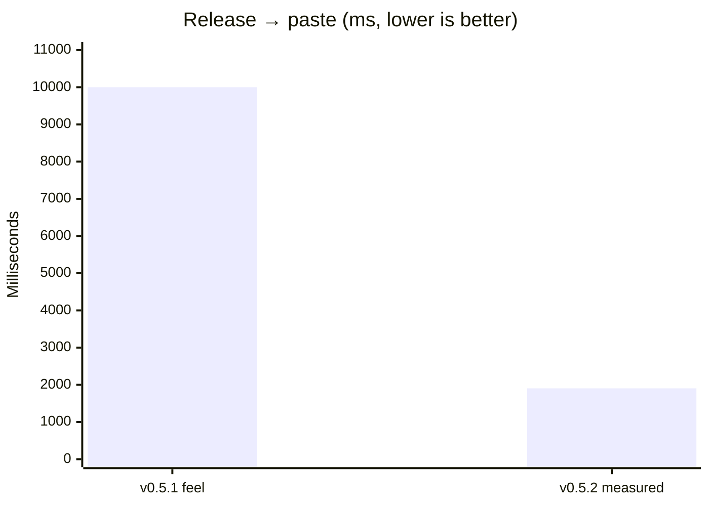
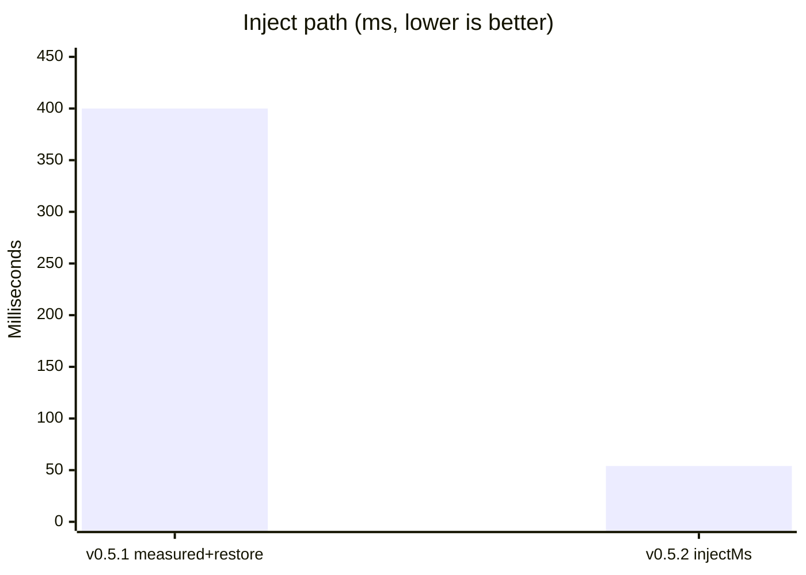

# Changelog

# 1.0.0 — The finished free product (2026-07-29)

Atmospeak 1.0.0 is a stabilization and verification release. It ships no new
features: it declares the 0.5.3 product surface complete, verified, and free.

### Changed

- Version bumped to 1.0.0 across the app, installer, and website.
- README now presents Atmospeak as a complete free product rather than an
  increment, and states the free commitment explicitly.

### Free commitment

Dictation, every local Whisper model, cleanup, Backtrack, injection, history,
dictionary, snippets, and on-device AI edit are free, unlimited, and require no
account. Everything shipped through 1.0.0 stays free. Any future paid capability
will be capability that does not exist today — nothing already shipped will be
moved behind a licence.

### Verification

Free-surface audit recorded in
[`docs/releases/v1.0.0-free-surface-audit.md`](docs/releases/v1.0.0-free-surface-audit.md).
No free-path regressions found; no gating exists anywhere in the codebase.

Automated gates green: frontend build, `tsc --noEmit`, 30 frontend tests, 77
Rust library tests, and the native paste-latency SLO. See the audit for the
native push-to-talk harness caveat.

### Operator acceptance (manual)

Unchanged from 0.5.3 and still run by hand — not marked done by CI. Cases from
production-100: **001**, **005**, **018–019**, **049–058**, **064**. These were
**not** executed for this release; see the audit.

# 0.5.3 — Backtrack + optional AI polish (2026-07-29)

### Added

- **Deterministic Backtrack** in cleanup: stutter phrase collapse (`is not is not`),
  triggered replaces (`actually` / `I mean` / `wait no`), expanded correction
  commands (`go back`, `forget that`), and a conservative restate heuristic.
- **Bundled local AI editor** (default): on-demand `llama-server` + curated
  Qwen2.5 0.5B GGUF. Toggle AI auto-edit → download once → polish stays on-device.
  No Ollama required. Advanced settings still allow Ollama / OpenAI-compatible.
- History **AI polish**, **Undo AI edit**, and **Redo AI edit** per session.
- Settings UI: simple model picker + setup button; advanced provider fields collapsed.
- Polish API keys stored in the **OS keyring** (never SQLite); env fallbacks remain.

### Changed

- Short utterances (≤5 s) always prefer the warm resident batch host over
  streaming finalize, even when a dock partial already appeared.
- Streaming chunk `merge_overlap` soft-extends boundary matches when at least
  one overlap word is acoustically confirmed.
- Auto-polish paste path never downloads or blocks on setup: if the bundled
  runtime is not ready, cleaned text pastes immediately (`polish-timeout` /
  `polish-fallback` logs distinguish failures).

### Operator acceptance (manual)

Still run by hand — not marked done by CI. Cases from production-100:
**018–019**, **049–058**, **064** (backtrack / polish / fallback paths).

# 0.5.2 — Release-to-paste speed (2026-07-29)

### Changed

- Made release→paste the product focus: clipboard restore no longer blocks the
  inject critical path, focus restore uses `AttachThreadInput`, and short clips
  without streaming commits prefer the warm resident host over a slow
  full-utterance streaming finalize on CPU.
- Streaming ASR now commits more aggressively (2 s force-split, 300 ms silence),
  drains smaller audio batches so VAD can run, and skips dock previews while the
  decode backlog is high so `StopSession` is not stuck behind UI candy.
- Streaming is always used for capture when the sidecar is available; the live
  preview setting no longer disables the streaming hot path.
- Native harness fixtures feed the streaming sidecar in real time and assert
  hard latency SLOs (`bun run validation:native-ptt`,
  `bun run validation:paste-latency`).

### Fixed

- Published the lazy batch ASR host before the multi-second streaming warmup so
  sound-check no longer reports `backend_unavailable` during sidecar load.
- Restored paste-target focus more reliably under automation and multi-window
  focus contention.

### Measured (native harness, warm `base.en`, ~3.2 s fixture)

| Metric | Before (v0.5.1 feel) | After (v0.5.2 gate) |
|--------|----------------------|---------------------|
| Release → paste (`totalMs`) | ~10 s user-reported | **1905 ms** (budget ≤2000) |
| Inject visible (`injectMs`) | inflated by +350 ms restore | **54 ms** (budget ≤150) |
| Paste-only wall (`pasteVisibleMs`) | n/a | **89 ms** (budget ≤300) |

# 0.5.1 — Streaming recovery (2026-07-28)

### Fixed

- Decoupled ASR host ingestion from inference so microphone frames no longer
  stall behind VAD and preview decodes, which was overflowing the upstream
  queues and discarding streamed work on the first dropped frame.
- Sent `StopSession` as soon as capture is flushed so the host finalizes the
  uncommitted tail while WAV teardown runs in parallel.
- Tolerated micro-drops (~250 ms) before falling back to batch, and closed the
  drop-accounting hole that could paste a silently truncated tail.
- Published a lazy resident `whisper-server` alongside streaming so batch
  fallback no longer pays a cold one-shot `whisper-cli` model load.
- Stopped calling `ShowWindow(SW_RESTORE)` on non-minimized paste targets, which
  was un-maximizing maximized windows.
- Clamped and settled the dock on drag end so it can no longer be stranded
  fully off-screen.

### Changed

- The ASR sidecar now runs a reader thread plus an inference worker, with stop
  priority over previews and Silero VAD limited to the trailing three seconds of
  the uncommitted chunk.

# 0.5.0 — Streaming local transcription (2026-07-28)

### Added

- Crash-isolated CPU and Vulkan ASR sidecars built on `whisper-rs` and
  `whisper.cpp`, with the selected model kept warm between dictations.
- Local Silero VAD, bounded speech segments, rolling dock previews, stable
  segments, and tail-only final reconciliation.
- Automatic Balanced model selection using locally recorded backend, backlog,
  dropped-frame, and finalization metrics.
- `Listening`, `Finalizing`, `Pasted`, `Saved`, and `Error` recorder phases,
  plus local streaming and shortcut diagnostic events.
- Persistent, sanitized shortcut events and per-dictation streaming metrics.

### Changed

- Long recordings are processed while capture is active instead of being
  decoded from the beginning only after stop.
- Live partial text appears only inside Atmospeak. The external target receives
  exactly one final paste after cleanup, dictionary replacement, and snippet
  expansion.
- Hold and Tap shortcuts now use mode-specific native gesture delivery. Hold
  stops on the first required key release; Tap stops on the next complete press.
- Streaming fallback order is Vulkan, CPU, resident `whisper-server`, then
  one-shot `whisper-cli`, with complete local audio retained for recovery.

### Fixed

- Eliminated release polling and `GetAsyncKeyState` as the keyed Hold-mode
  release source of truth.
- Prevented duplicate gestures, duplicate paste, stale ASR warmups, overlapping
  ASR sessions, unbounded sidecar audio growth, and committed-text duplication
  in rolling previews.
- Preserved full fallback recordings across queue pressure and streaming WAV
  write failures.

# 0.3.1 — Recovery candidate (unpublished)

- Withdraws the defective 0.3.0 release and keeps public downloads paused.
- Forces setup v2 for every legacy profile until a host-backed microphone phrase
  check produces a valid calibration.
- Creates setup, hub, and overlay WebViews lazily according to lifecycle state.
- Adds real microphone discovery, capture metrics, speech-quality rejection,
  conservative normalization, and actionable sound-check failures.
- Restores the supplied six-step setup, editorial hub, native dock dragging,
  position persistence, model management, and motionless idle dock.
- Repairs setup shortcut validation so its temporary Windows hook is genuinely
  unpaused, keyed chords preserve modifier state, and completion waits for a
  full press-and-release gesture.
- Replaces title-only installer smoke testing with WebView2 DOM assertions and
  adds canonical Home/History screenshot regression coverage.

This build is not approved for publication until the Elgato Wave:3 phrase check,
production tests 001 and 005, and the seven-day daily-driver gate are complete.

## 0.3.0 — Phase B resident ASR host (2026-07-25)

### Added
- Resident `whisper-server.exe` (`services/asr_host.rs`) keeps the speech model warm
  instead of reloading it per utterance. Bundled from the same upstream archive as the
  CLI; see `docs/PHASE_B_ASR_HOST.md`.
- Automatic degradation to the one-shot CLI whenever the host is missing, disabled,
  slow to start, or failing mid-session. A dead host is respawned on the next utterance.
- `StageMetrics.asr_backend` now reports `"host"` or `"cli"` per utterance.
- `ATMOSPEAK_WHISPER_HOST=0` forces the CLI backend.
- Windows job object ties the server's lifetime to the app, so a crash or force-kill
  leaves no orphaned process holding the model.
- Verified, cancellable model downloads for Tiny English, Small English, Medium English,
  and Distil Large v3, with real on-disk inventory and bundled Base English fallback.
- MIT project license, complete redistributed runtime/model acknowledgements, Atmospeak
  application icons, version-sync tooling, and a GitHub Pages deployment workflow.
- Rebranded landing page with version-derived release assets and Windows install,
  SmartScreen, hotkey, microphone, local-data, and latency documentation.

### Fixed
- **Terminal phases never settled.** `tick_settle` only ran when a new command arrived,
  so the overlay stayed on `Pasted`/`Error` until the next user action. The engine worker
  now wakes itself on the settle deadline.
- **`handle_dictation_action` bypassed the mode table.** `"pressed"`/`"released"` mapped
  to unconditional start/stop, so overlay buttons behaved differently from the hotkey in
  toggle mode. They now route through the mode-aware arms (D10).
- Whisper subprocesses no longer flash a console window on every utterance
  (`CREATE_NO_WINDOW`).
- An empty transcript is reported as "no speech" rather than provoking a redundant
  CLI retry of audio the host already handled correctly.
- Normal launches now stay in the tray after onboarding. Tray hide/show preserves the
  saved dock position; resetting it is a separate explicit action.
- Updater and release URLs consistently target `leviathofnoesia/atmospeak`.

### Companion dock (design handoff)
- Imported the Claude Design project and closed the integration gaps. The dock port
  itself was already faithful (`base.css`, Aura geometry, `atmoGlass` refraction,
  `dock__right`/timer/insert/discard, `dock-tip`, wave styles); what was missing was
  the app telling it anything.
- The overlay rendered inside an opaque, scrolling box: `body.is-overlay-window` was
  defined in `App.css` but never applied, so the window inherited `:root`'s opaque
  background — defeating `transparent: true` — and a 640px `min-height` inside a 150px
  window. Drag (`startDragging`) and open-hub were likewise never wired through.
- Overlay position now persists (`overlay-position.json`); startup restores it and only
  the tray action resets to bottom-centre.
- `InjectionResult.targetProcessName` was hardcoded `None` everywhere; it is now resolved
  via `GetWindowThreadProcessId` + `QueryFullProcessImageNameW`, so the dock reads
  "Set down in Notepad" instead of "in your cursor".
- Ported the `data-shape` rest silhouettes (capsule, tape) the earlier port had dropped.
- The resting tip names the real chord ("hold Ctrl+Win"), not the handoff's macOS
  `⌥space`, and greys to "runtime offline" when the speech runtime is missing.

### Changed
- **The Phase A 12-field settings contract lock is deliberately lifted.** `AppSettings`
  gains five appearance fields — accent, resting shape, voice wave, dock theme, motion —
  promoted from the design prototype's tweak panel into real persisted settings, with
  controls in Settings → Companion. `docs/PHASE_A_HONEST_MVP.md` D4 describes the lock as
  it stood for Phase A and is kept as a historical record. Container-level
  `serde(default)` means blobs written before this change still load with the new fields
  defaulted.
- The prototype's `desktop.jsx` (a faux desktop to dictate into) and `tweaks-panel.jsx`
  (a design exploration panel) are deliberately not ported. `hub.jsx`'s visual system was
  already present in `hub.css`; its Polish button, privacy auto-delete and language rows
  were **not** reinstated — those are the phantom capabilities Phase A removed.

### Tests
- Replaced the tautological `dictation_engine` placeholder with real coverage of the
  frozen transition table: one `Pressed` → one `Listening`, re-entry while `Processing`
  is ignored, toggle ignores key-up, mic-check exclusion, cancel guards, settle bounds.
- Settings blobs written before the appearance fields still load (the contract-lift risk).
- Dock tip placement per resting shape, real-chord/gesture wording, runtime-offline state.
- Rust suite: 16 → 32 tests. Frontend: 8 → 11.

## 0.2.0 — Phase A Honest MVP (2026-07-25)

### Added
- Rust `DictationEngine` actor (`services/dictation_engine.rs`) owns the dictation state machine.
- Hotkey (Windows LL hook) and tray route through `dispatch_fire_and_forget` (single path).
- Blocking IPC `start_recording` / `stop_recording` remain engine-backed with existing return shapes.
- Commands: `handle_dictation_action`, `mic_check_start` / `mic_check_stop`, `set_shortcut_test_active`, `get_runtime_events`, `get_last_stage_metrics`, `show_main_window`.
- Injection: last external HWND restore, soft-fail leaves transcript on clipboard, expanded `InjectionResult`.
- Stage metrics (`capture_stop_ms`, `write_ms`, `asr_ms`, `cleanup_ms`, `inject_ms`, `total_ms`, `asr_backend: "cli"`).
- App data directory `%LOCALAPPDATA%\Atmospeak` with one-way migrate from `Wind Speak` (DB filename kept).
- Onboarding version unified: `phase-a-honest-mvp-v1` (Rust + TS).
- Docs: `docs/PHASE_A_HONEST_MVP.md`, `docs/PHASE_B_ASR_HOST.md`.

### Changed
- Frontend `AppSettings` locked to the 12 Rust fields; phantom polish/privacy/export/FFT/language UI removed.
- Startup Run key renamed to `Atmospeak` (legacy `Wind Speak` removed on update).
- README honesty: CLI latency is multi-second; no false streaming/polish claims.

### Notes
- Persistent Whisper host is **not** shipped (stock `whisper-cli` is one-shot only). See Phase B doc.
- Production mic matrix 001–012 still requires operator evidence on a machine with MSVC + mic.

## Unreleased (historical pre-0.2.0 draft notes)

Earlier CHANGELOG “Unreleased” bullets describing polish/FFT/privacy as shipped were **frontend/docs ahead of backend** and are superseded by 0.2.0 honesty.
