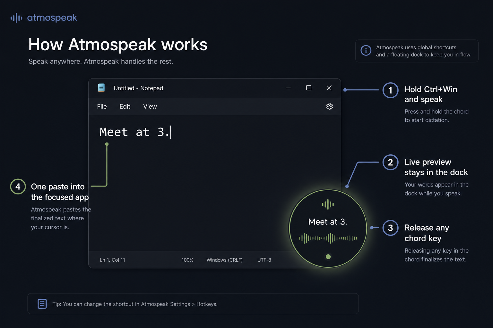
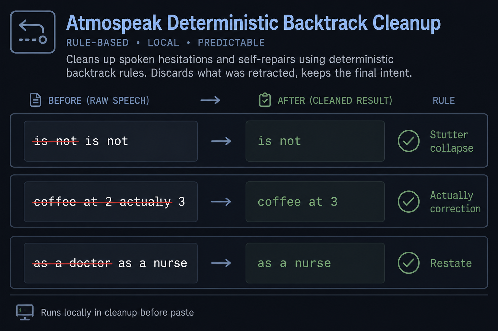
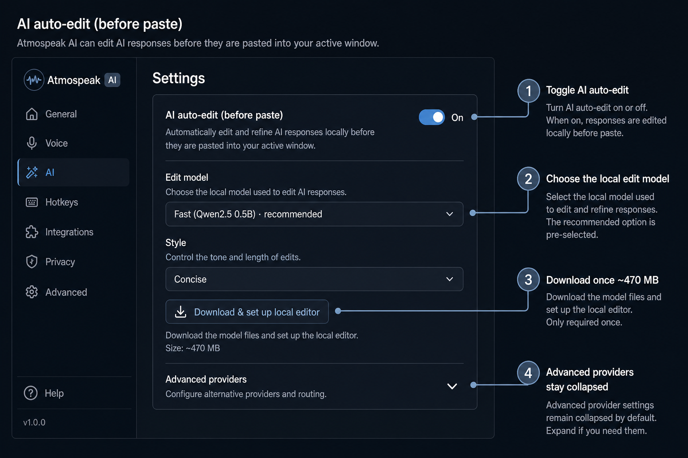
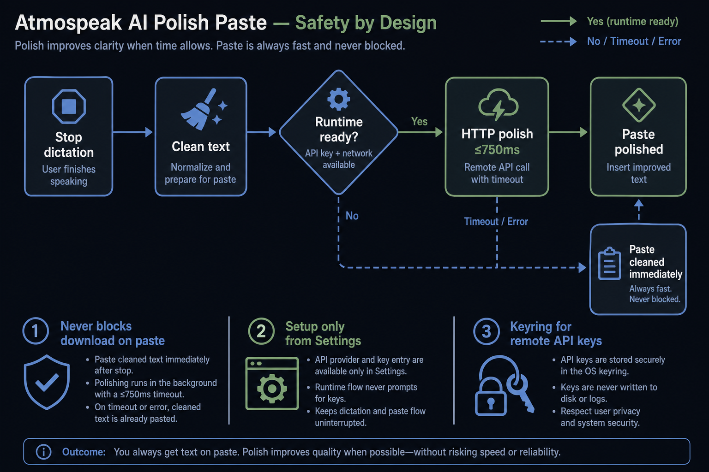
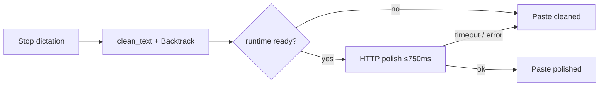
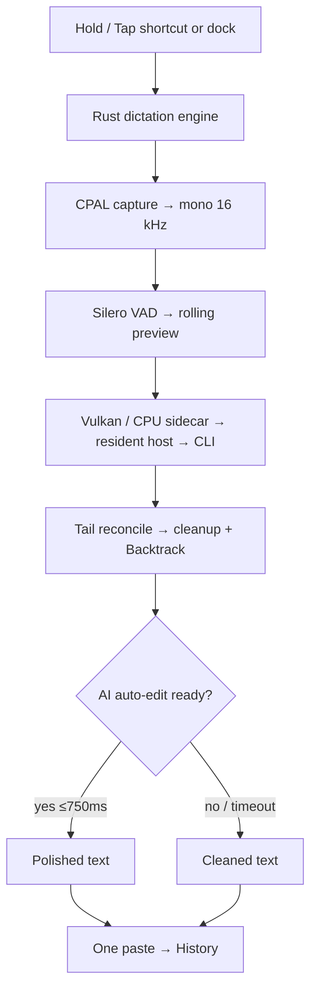
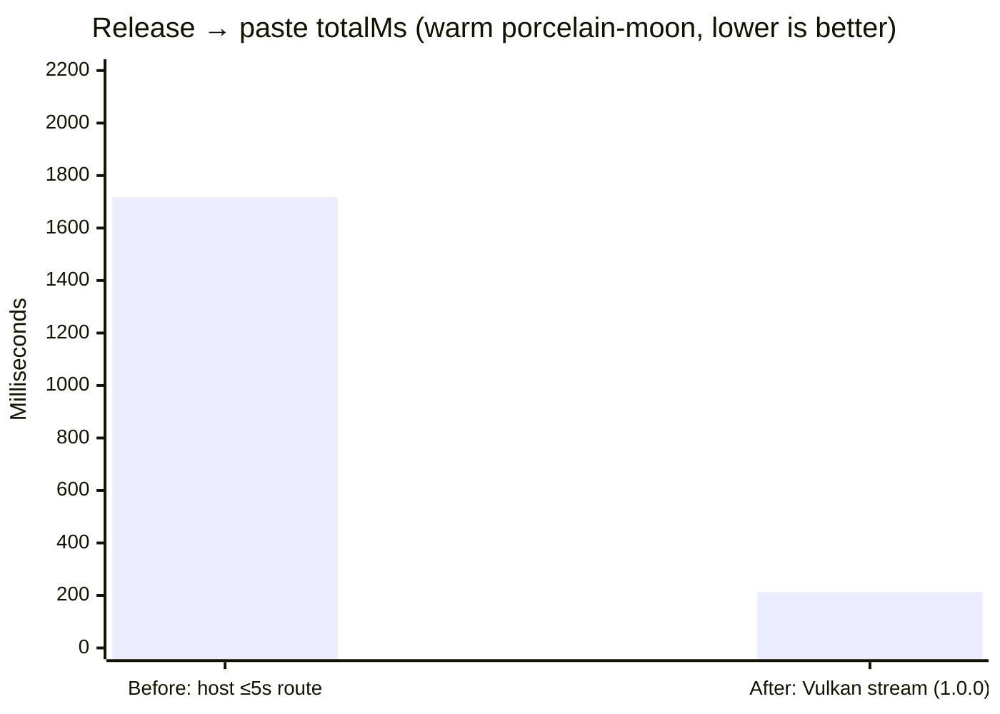

<p align="center">
  
</p>

<h1 align="center">Atmospeak</h1>

<p align="center">
  Streaming, local-first voice dictation for Windows. Speak naturally, preview locally, and paste once.
</p>

<p align="center">
  <a href="https://github.com/leviathofnoesia/atmospeak/releases/latest"></a>
  <a href="https://github.com/leviathofnoesia/atmospeak/releases/download/v1.0.3/atmospeak_1.0.3_x64-setup.exe"></a>
  <a href="LICENSE"></a>
</p>

<p align="center">
  <a href="https://leviathofnoesia.github.io/atmospeak/"><strong>Website</strong></a>
  ·
  <a href="https://github.com/leviathofnoesia/atmospeak/releases/download/v1.0.3/atmospeak_1.0.3_x64-setup.exe"><strong>Download v1.0.3</strong></a>
  ·
  <a href="https://github.com/leviathofnoesia/atmospeak/releases/tag/v1.0.3"><strong>Release notes</strong></a>
</p>

Atmospeak is a Windows desktop dictation app built around a local
[`whisper.cpp`](https://github.com/ggerganov/whisper.cpp) runtime. It requires
no account and sends no microphone audio to a transcription service.

## What ships in 1.0.0

Version 1.0.0 is the complete Atmospeak dictation product. It is not a preview
of something paid — it is the finished free application, and everything below is
unlimited and requires no account.

- **Speak and paste.** Hold or tap your hotkey, watch the live preview in the
  dock, and get exactly one paste into whatever application had focus. Warm
  short clips target under 500&nbsp;ms from key release to paste on the native
  Vulkan streaming validation path; actual latency depends on machine and
  utterance.
- **Local Whisper, your choice of model.** A bundled model works immediately;
  the downloader adds larger ones. Streaming ASR runs on Vulkan and falls back
  to CPU on its own.
- **Deterministic Backtrack.** Cleanup collapses stutters, applies
  `actually` / `I mean` / `wait no`, honors `go back` / `forget that`, and
  keeps the later ending on restates like `as a doctor…as a nurse`.
- **Optional on-device AI edit.** Toggle AI auto-edit, download a small local
  editor once (~470&nbsp;MB), and polish stays on your machine. Advanced settings
  still allow Ollama or OpenAI-compatible endpoints; API keys live in the OS
  keyring.
- **Paste never waits on setup.** If the local editor is not ready yet,
  Atmospeak pastes cleaned text immediately. Timeouts and errors fall back the
  same way.
- **Your words stay yours.** Searchable history with export, undo / redo for AI
  edits, a personal dictionary, snippets, and local diagnostics — all on disk,
  on your machine.

Latest patch notes: [`docs/releases/v1.0.3.md`](docs/releases/v1.0.3.md).
The 1.0.0 product declaration remains in
[`docs/releases/v1.0.0.md`](docs/releases/v1.0.0.md). Speed charts from 0.5.2
remain in [`docs/releases/v0.5.2.md`](docs/releases/v0.5.2.md).

## Install

Atmospeak currently supports **Windows 10/11 x64**.

| Package | Use it when | Download |
| --- | --- | --- |
| Setup EXE | Recommended installation | [atmospeak_1.0.3_x64-setup.exe](https://github.com/leviathofnoesia/atmospeak/releases/download/v1.0.3/atmospeak_1.0.3_x64-setup.exe) |
| MSI | Managed or MSI-based deployment | [atmospeak_1.0.3_x64_en-US.msi](https://github.com/leviathofnoesia/atmospeak/releases/download/v1.0.3/atmospeak_1.0.3_x64_en-US.msi) |
| Portable ZIP | Run without a system-wide install | [atmospeak_1.0.3_x64-portable.zip](https://github.com/leviathofnoesia/atmospeak/releases/download/v1.0.3/atmospeak_1.0.3_x64-portable.zip) |
| Checksums | Verify downloaded artifacts | [SHA256SUMS.txt](https://github.com/leviathofnoesia/atmospeak/releases/download/v1.0.3/SHA256SUMS.txt) |

The Windows installers are not Authenticode-signed yet. SmartScreen may show
**Windows protected your PC**. Choose **More info**, verify the app name is
Atmospeak, and choose **Run anyway**. You can verify the download against the
published SHA-256 manifest before opening it.

## Daily use

<p align="center">
  
</p>

1. Complete the six-step first-run setup and its real microphone transcription.
2. Leave Atmospeak in the tray.
3. Choose **Hold** or **Tap** in Settings.
4. In Hold mode, hold the default `Ctrl+Win` shortcut, speak, then release any
   chord key. In Tap mode, press the chord once to start and again to stop.
5. Watch the local preview in the dock while speaking. Atmospeak finalizes the
   remaining tail and pastes once at the cursor that was active when recording
   began.

If Windows prevents a normal
process from injecting into a higher-integrity application, Atmospeak leaves
the transcript on the clipboard instead of discarding it.

Local application data lives under:

```text
%LOCALAPPDATA%\Atmospeak
```

That directory contains settings, history, downloaded models, diagnostics, and
the local database. Atmospeak does not require a cloud account.

## Backtrack (always on in cleanup)

<p align="center">
  
</p>

When cleanup is enabled, Atmospeak applies deterministic edits before paste:

| You said | Pasted result |
| --- | --- |
| `is not is not` | `is not` |
| `coffee at 2 actually 3` | `coffee at 3` |
| `draft one go back draft two` | `draft two` |
| `hire me as a doctor as a nurse` | `hire me as a nurse` |
| `I want coffee I want tea` | `I want tea` |

No network call is required for Backtrack.

## Optional AI auto-edit

<p align="center">
  
</p>

1. Open **Settings** and enable **AI auto-edit before paste**.
2. Pick the recommended local model (Qwen2.5 0.5B).
3. Click **Download & set up local editor** (or let the first toggle kick off
   setup in the background). Progress appears in Settings.
4. After setup completes, short dictations can polish within the 750&nbsp;ms
   auto-edit budget. History can still **Undo AI edit** / **Redo AI edit**.

Advanced provider settings stay collapsed by default. Remote OpenAI-compatible
keys are stored in the OS keyring (`atmospeak` / `polish-api-key`), with
`ATMOSPEAK_POLISH_API_KEY` or `OPENAI_API_KEY` as env fallbacks — never SQLite.

### Paste safety when polish is enabled

<p align="center">
  
</p>



Setup and downloads happen only from Settings (or the background job started
when you enable the toggle). The paste path never waits on a model download.

## Speech models

The bundled Whisper model works immediately. Optional models download from their
published Hugging Face repositories into Atmospeak's local model directory,
stream to a temporary file, and are installed only after their pinned SHA-256
hash passes.

| Atmospeak ID | Upstream model | Availability | Approx. size |
| --- | --- | --- | ---: |
| `tiny.en` | Whisper Tiny English | Setup / Settings | 75 MB |
| `base.en` | Whisper Base English | **Bundled default** | 142 MB |
| `small.en` | Whisper Small English | Setup / Settings | 466 MB |
| `medium.en` | Whisper Medium English | Settings | 1.43 GB |
| `large-v3-turbo-q5` | Whisper Large v3 Turbo q5 | Settings | 548 MB |
| `distil-large-v3.5` | Distil-Whisper Large v3.5 | Settings | 1.42 GB |
| `distil-large-v3` | Distil-Whisper Large v3 | Legacy installs | 1.42 GB |

Optional **AI edit** model (separate from Whisper):

| Atmospeak ID | Upstream | Availability | Approx. size |
| --- | --- | --- | ---: |
| `qwen2.5-0.5b` | Qwen2.5 0.5B Instruct GGUF | Settings → AI auto-edit | ~470 MB |

If an optional Whisper selection is missing, Atmospeak falls back to the
bundled `base.en` model. Advanced Settings can also point to a custom compatible
Whisper CLI and GGML model.

## How it works



Ordinary dictation is rejected before ASR when it is effectively silent, too
quiet, or too noisy. This prevents empty recordings from becoming Whisper
hallucinations.

### Speed (unchanged gates from 0.5.2)

Measured on a warm `base.en` CPU path with the porcelain-moon fixture
(~3.2 s audio).



| Metric | Before (≤5 s → warm host) | After (Vulkan streaming) | Gate |
| --- | ---: | ---: | ---: |
| Release → paste (`totalMs`) | ~1250–1840 ms | **190–244 ms** | ≤ **500** ms |
| Inject (`injectMs`) | ~54–55 ms | ~54–55 ms | ≤ 150 ms |
| Paste-only wall (`pasteVisibleMs`) | — | — | ≤ 300 ms |

## Build from source

Requirements:

- Windows 10/11 x64
- Rust toolchain
- Visual Studio Build Tools with **Desktop development with C++**
- [Bun](https://bun.sh/)
- [Git LFS](https://git-lfs.com/)

```powershell
git clone https://github.com/leviathofnoesia/atmospeak.git
cd atmospeak
git lfs install
git lfs pull
bun install
bun run tauri dev
```

The bundled GGML model and `whisper.cpp` binaries are LFS-tracked. If a clone
contains pointer files instead of the runtime, recover them with:

```powershell
powershell -ExecutionPolicy Bypass -File scripts/bootstrap-whisper.ps1
```

Optional: refresh the bundled `llama-server` stub path with:

```powershell
powershell -ExecutionPolicy Bypass -File scripts/bootstrap-llama.ps1
```

(If missing, Atmospeak can still download the polish runtime into
`%LOCALAPPDATA%\Atmospeak` when you run **Download & set up**.)

## Validate a change

```powershell
bun run build
bun run test
bun run e2e
bun run site:build
cargo test --manifest-path src-tauri/Cargo.toml
```

The native push-to-talk harness exercises shortcut persistence, key-down,
key-up, transcription, target restoration, exactly one native paste, and the
release→paste / inject latency gates:

```powershell
bun run validation:native-ptt
bun run validation:paste-latency
```

The deterministic audio seam exists only in debug builds. Release acceptance
still requires real microphone runs for Notepad one-shot (`001`) and
push-to-talk (`005`), plus polish/backtrack cases **018–019**, **049–058**,
**064**, recorded in
[`tests/manual/production-run-log.md`](tests/manual/production-run-log.md).

## Current boundaries

- Windows x64 only.
- Unsigned installers; SmartScreen warnings remain.
- No cloud STT, mobile client, cross-device synchronization, or live typing
  into the target application.
- Live preview is local and appears only in the Atmospeak dock.
- AI auto-edit is optional and must not block paste; first-time setup is
  Settings-driven and downloads ~470&nbsp;MB once.
- Latency depends on speech length, selected model, GPU/CPU performance, and
  current ASR backlog. Short warm fixtures remain gated; Atmospeak does not
  promise a fixed latency on every machine or utterance.
- Updating downloads the complete installer; Tauri does not provide delta
  updates here.

## What is free

Dictation, every local Whisper model, cleanup, Backtrack, injection, history,
dictionary, snippets, and on-device AI edit are **free, unlimited, and require no
account** in the public MIT build.

Everything shipped through 1.0.0 stays that way for the free edition. Paid
capability lives in a **separate Atmospeak Pro build** (online Polar licence,
gated updates, Pro-only modules such as airplane mode and the network ledger).
See [`docs/PRO_BUILD.md`](docs/PRO_BUILD.md) and [`docs/POLAR.md`](docs/POLAR.md).

Canonical download and buy links: [novpax.org/projects/atmospeak](https://www.novpax.org/projects/atmospeak).
Free updater feed: `https://www.novpax.org/downloads/atmospeak/free/latest.json`.

## Project

Atmospeak uses Tauri 2, React, TypeScript, Rust, SQLite, CPAL, WebView2, and
`whisper.cpp`. It is clean-room software and does not contain proprietary code,
assets, or model services from competing dictation products.

See [`docs/RELEASE.md`](docs/RELEASE.md) for packaging and updater details,
[`docs/MODEL_BOOTSTRAP.md`](docs/MODEL_BOOTSTRAP.md) for runtime recovery, and
[`tests/manual/production-100.md`](tests/manual/production-100.md) for the
manual production matrix.

Atmospeak source code is available under the [MIT License](LICENSE). Bundled
third-party notices are reproduced in
[`src-tauri/resources/ACKNOWLEDGEMENTS.md`](src-tauri/resources/ACKNOWLEDGEMENTS.md).
