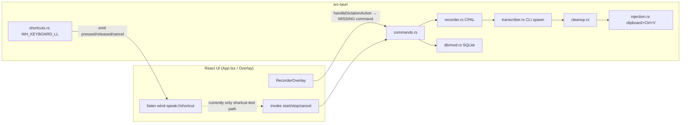
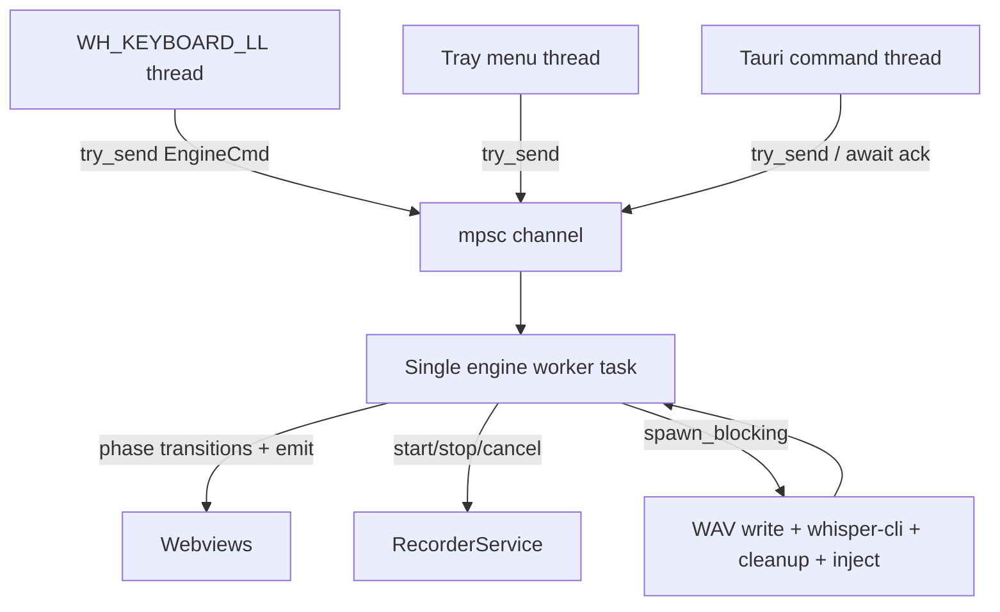
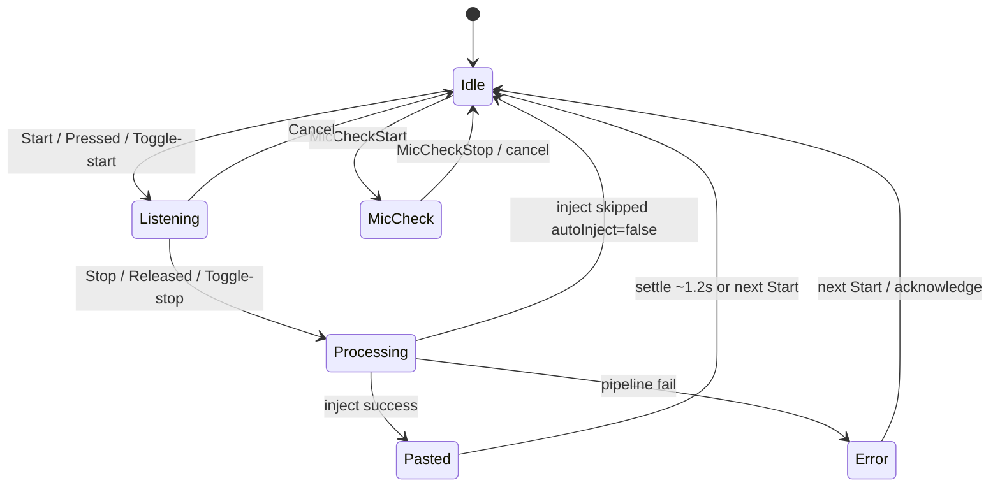
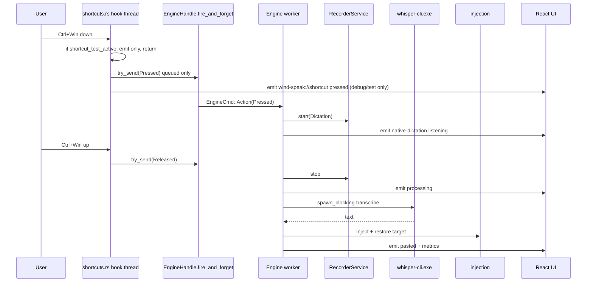
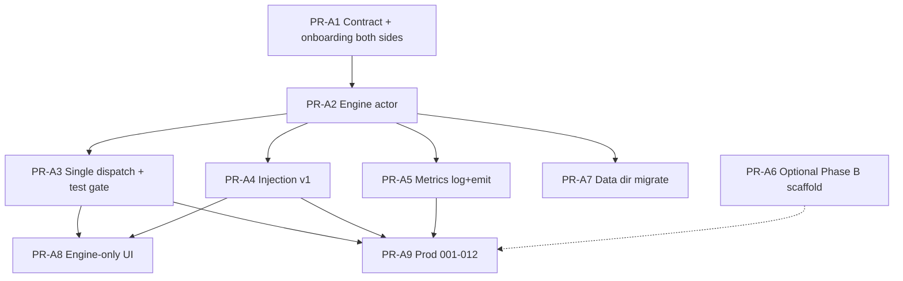

# Phase A — Honest MVP for Atmospeak

| Field | Value |
|-------|-------|
| **Document** | Phase A Honest MVP Design |
| **Author** | _TBD_ |
| **Date** | 2026-07-24 |
| **Status** | Implemented in tree (0.2.0) — mic 001–012 evidence still operator-pending |
| **Repo** | `C:\Users\billy\Documents\atmospeak` (fork of leviathofnoesia/wind-speak) |
| **App version** | 0.2.0 (`package.json`, `src-tauri/tauri.conf.json`, `Cargo.toml`) |
| **Stack** | Tauri 2 + React 19 + Rust + SQLite (rusqlite bundled) + bundled whisper.cpp CLI |

---

## Overview

Atmospeak is a Windows-first, local-offline desktop dictation app. The product promise for Phase A is honest and narrow: hold a global hotkey, speak a short English phrase, release, and cleaned text appears in the focused app (e.g. Notepad) **reliably**, with a UI that never claims capabilities the backend does not implement.

A contract audit found large **frontend/backend drift**. TypeScript types, `src/lib/api.ts`, `App.tsx`, `TODO.md`, `CHANGELOG.md`, and `paritygoal.md` describe polish, privacy mode, FFT bands, export, streaming partials, recent apps, session notes, feedback webhooks, and a native dictation engine. The Rust binary only registers a thin command surface and still runs the hot path as: **CPAL buffer → write WAV → spawn `whisper-cli.exe` per utterance → regex cleanup → clipboard + `SendInput` Ctrl+V with fixed 350 ms restore**. Shortcuts emit events that the React layer uses only for shortcut-test (not real dictation); several UI paths invoke commands that do not exist.

**Phase A** locks the contract to what works, moves ownership of the dictation loop into a Rust `DictationEngine` (actor/channel concurrency), hardens injection with last-target restore, keeps **CLI ASR as the ship path**, instruments stage timings, and validates tests 001–012. Persistent Whisper host is **out of Phase A ship gate** (Phase B or optional stretch only with a real new binary — stock `whisper-cli.exe` cannot host a keep-alive protocol).

### Exit criteria (split)

| Gate | Requirement | Blocks ship? |
|------|-------------|--------------|
| **Hard — Honesty** | No UI/API claims false capabilities; TS settings/commands match Rust 1:1 for implemented features | Yes |
| **Hard — Reliability** | Production tests **001** and **005** pass (one-shot sentence → Notepad; PTT press/release). Tray/overlay/hotkey share one engine. Injection restores last external target when possible | Yes |
| **Soft — Snappy** | p50 release→pasted ≤ 1.0 s (warm resident model) | **Only if** a Phase B host/in-process ASR ships; **not** required for Phase A MVP with CLI |

Phase A marketing/README copy must describe CLI latency honestly (typically multi-second per utterance on cold model load; often 2–5 s+ p50 for short phrases with per-process spawn).

---

## Background & Motivation

### Current architecture (as implemented)



### Pain points (concrete)

| # | Finding | Evidence |
|---|---------|----------|
| 1 | **Settings contract drift** | Rust `AppSettings` has 12 fields (`src-tauri/src/models.rs`). TS has ~20 extra parity fields. On `save_settings`, the **invoke payload is deserialized into the 12-field Rust struct** (unknown keys ignored by serde); only those 12 fields are re-serialized to SQLite. Parity fields are **UI-only / in-memory** and vanish after refresh — they were never persisted via the Tauri path. Production DB blobs from this binary are already 12-field JSON. |
| 2 | **Command surface drift** | Registered commands in `lib.rs`: `get_app_snapshot`, `get_shortcut_status`, `get_recording_level`, `list_microphones`, `save_settings`, `set_shortcuts_paused`, `show_overlay_window`, `start_recording`, `stop_recording`, `cancel_recording`, `inject_text`, dictionary/snippet CRUD, `get_model_status`, `get_model_inventory`. Frontend also calls: `get_recording_fft_bands`, `get_runtime_events`, `handle_dictation_action`, `set_shortcut_test_active`, `show_main_window`, `list_recent_apps`, `search_sessions`, `export_session`, `update_session_notes`, `polish_session`, `submit_feedback`. |
| 3 | **No DictationEngine** | Hot path is orchestrated by `stop_recording` + React `handleToggleRecording` / `finishRecording`. Overlay uses `handleDictationAction` (missing). Shortcut listener in `App.tsx` handles **shortcut test only** — no `pressed`/`released` → start/stop for real dictation after the test branch. Real dictation from main UI works only via explicit button → `start_recording`/`stop_recording`. |
| 4 | **Phantom events** | UI listens for `wind-speak://native-dictation`, `transcript-partial/stable/final`, `runtime-event`. Backend never emits them (only `shortcut`, `shortcut-status`, `overlay-visibility`). Overlay phase is mirrored via **React-emitted** `wind-speak://dictation-state` from main window. |
| 5 | **Cold whisper per utterance** | `transcriber::transcribe` spawns `whisper-cli.exe -m … -f … -nt -np` every time. Bundled binary is **one-shot CLI only** (no server/keep-alive/stdin protocol). Model load dominates latency. |
| 6 | **Injection is fragile** | `injection::inject_text`: set clipboard → `SendInput` Ctrl+V → sleep 350 ms → restore. No focus restore, no last-target capture (`AppState.last_external_target_window` exists unused). |
| 7 | **Legacy branding in data plane** | App data dir: `%LOCALAPPDATA%\Wind Speak`; DB file: `wind-speak.sqlite3`; env override `WIND_SPEAK_APP_DATA_DIR`; startup reg value `"Wind Speak"`. |
| 8 | **Docs claim false completion** | `TODO.md` / `CHANGELOG.md` mark Tier 0/1 items done that are frontend-only or non-existent in Rust. |
| 9 | **Onboarding version split** | Rust `ONBOARDING_VERSION = "desktop-parity-v5"` (`lib.rs`); TS `onboardingVersion = "desktop-runtime-parity-v1"` (`App.tsx`). Completing onboarding saves the TS string; Rust then treats every launch as `needs_onboarding` (focus main) while TS may not show Onboarding UI — inconsistent UX. |

### Why Phase A now

Shipping further Tier-N polish on a lying contract multiplies rework. The honest MVP re-establishes a single source of truth so every subsequent phase builds on a working loop rather than mock surfaces.

---

## Goals & Non-Goals

### Goals (Phase A exit)

1. **Contract lock**: Rust `AppSettings` + registered commands + TS types + `api.ts` mocks align 1:1 for implemented features.
2. **`DictationEngine` owns the loop**: idle → listening → processing → pasted/error; UI only renders engine events (`native-dictation`).
3. **Shortcuts/tray/overlay hook into the engine in Rust**, not React (single dispatch path).
4. **CLI ASR is the Phase A ship path**; document latency honestly; **hide live-preview / streaming claims**. No invented protocol on stock `whisper-cli.exe`.
5. **Injection chain v1** with last-target focus restore before paste (with failure fallbacks).
6. **Production tests 001–012** with stage timings; **hard pass 001 + 005**.
7. **Honest UI**: strip, gate, or mark-as-unavailable every control that invokes a missing capability.
8. **Both PTT and toggle modes** work via the frozen signal mapping table (settings already expose both).

### Non-Goals (Phase B+)

- Per-app transform profiles beyond optional process-name capture if trivial
- Undo last paste / re-dictate replace / dictionary learn-from-diff
- Local LLM polish productization, cloud STT
- Streaming partials productization
- **Custom whisper build, whisper-server bundle, or in-process `whisper-rs` bindings** unless a pre-existing ready artifact is already in-tree (explicit Phase B; see D3)
- macOS / Linux, sync, mobile
- Full Tier 1 parity checklist completion
- Authenticode signing
- Full FTS history search, export formats, notes, feedback webhooks (gate or remove in UI)

---

## Key Decisions

| Decision | Choice | Rationale |
|----------|--------|-----------|
| **D1. Engine ownership** | New Rust `services/dictation_engine.rs` owns start/stop/cancel/process; React is a view | Fixes broken shortcut→dictation path; tray/overlay/hotkey share one state machine |
| **D2. Event namespace** | Keep `wind-speak://*` primary; dual-emit `atmospeak://*` for **new** events from A2 (`native-dictation`, `stage-metrics`, `runtime-event`) | Minimizes breakage; full rename deferred |
| **D3. ASR strategy (Phase A)** | **CLI-only ship path**: keep `transcriber::transcribe` spawning bundled `whisper-cli.exe` per utterance. **Do not** invent JSON-stdin protocols for stock CLI (verified: one-shot only). Persistent host / whisper-rs is **Phase B** with an explicit new binary or bindings plan. Optional PR-A6 is scaffold-only (`asr_backend: "cli"` label + kill-switch docs), not a ship dependency | Stock binary cannot host; custom host expands Phase A unboundedly |
| **D4. Settings schema** | Phase A settings = **exactly** the 12 Rust fields; remove parity fields from TS `AppSettings` used by `save_settings`. No unknown-key stashing | Stops UI lies; no production recovery of parity fields needed (never persisted via Tauri) |
| **D5. App data path** | Prefer `%LOCALAPPDATA%\Atmospeak`; migrate once from Wind Speak; **keep DB filename `wind-speak.sqlite3`** inside the new dir (lower risk). Accept `ATMOSPEAK_APP_DATA_DIR` then `WIND_SPEAK_APP_DATA_DIR` | Branding without risky rename; dual env for tests |
| **D6. Frontend honesty** | A1 strips dead invokes + panel controls; A8 moves hub fully event-driven after engine is sole owner for shortcuts (A3) | Clear PR ownership; hub may keep blocking start/stop until A8 (D14) |
| **D7. Metrics** | **Required:** structured stage timings log + emit `stage-metrics` + `AppState.record_event`. **Optional:** SQLite `dictation_metrics` table (last 500) | Tests need fields in run log; DB table is convenience |
| **D8. Onboarding version** | Unify **both** Rust and TS to `phase-a-honest-mvp-v1` in **PR-A1** (same merge) | Avoid half-migrated builds; users re-onboard once |
| **D9. Engine concurrency** | Actor: `mpsc` of `EngineCmd`, single worker; **hook/tray** use fire-and-forget `try_send` only; **IPC** may block on oneshots for result shapes; heavy work on `spawn_blocking` | Never run ASR on WH_KEYBOARD_LL thread |
| **D10. Mode signal map** | Frozen table (see below); both PTT and toggle required for Phase A exit | Prevents double-stop / ignored tray |
| **D11. Shortcut path** | Hook/tray **only** fire-and-forget dispatch; emit `wind-speak://shortcut` for test UI/debug only; React **must not** start dictation from shortcut events after A3 | No double start/stop |
| **D12. Mic-check** | Dedicated `mic_check_start` / `mic_check_stop` with `RecorderPurpose::MicCheck`; never inject; mutual exclusion with dictation; **not** mirrored on `native-dictation` | Prevents engine/recorder collision; keeps DictationPhase enum clean |
| **D13. Overlay state source** | Engine emits `native-dictation` as **sole** phase/result source for dictation; overlay prefers it; React stops emitting authoritative `dictation-state` by A3/A8 | Avoid fighting dual sources |
| **D14. Transitional blocking start/stop IPC** | Through **A8**, `start_recording` / `stop_recording` remain **engine-backed but awaitable with today's return shapes** (`RecordingStarted` / `DictationResult`). Hook/tray never use these blocking commands. A8 may switch hub to pure events and deprecate blocking stop | A2 must not break main-window `finishRecording` await path |

### Frozen mode × signal mapping (D10)

`shortcuts.rs` emits `"pressed" | "released" | "cancel"` only. Tray emits `"toggle"` (today via event; Phase A becomes `dispatch(Toggle)`). Mapping:

| Mode | `pressed` | `released` | tray / UI `toggle` | `cancel` |
|------|-----------|------------|--------------------|----------|
| **pushToTalk** | Start if Idle (or Pasted/Error settled) | Stop→Processing if Listening | Toggle start/stop (same as edge: if Idle start, if Listening stop) | Cancel Listening (or best-effort) |
| **toggle** | Toggle start/stop | **Ignore** | Same as `pressed` | Cancel Listening |

Mode is read from settings at command-handle time. Both modes are **required** for Phase A exit (settings/onboarding already ship them).

---

## Proposed Design

### Module layout under `src-tauri/src/services/`

```
src-tauri/src/
  lib.rs                 # register commands; spawn engine worker; wire shortcuts → dispatch
  commands.rs            # thin IPC adapters only (no pipeline orchestration)
  models.rs              # AppSettings (locked), events, StageMetrics, engine DTOs
  db/mod.rs              # settings + sessions + optional metrics; migration
  services/
    mod.rs
    app_state.rs         # holds EngineHandle, recorder, db, targets
    dictation_engine.rs  # NEW: actor + state machine + orchestration
    recorder.rs          # CPAL capture; purpose: Dictation | MicCheck
    transcriber.rs       # CLI spawn (Phase A ship path)
    cleanup.rs           # unchanged regex pipeline
    injection.rs         # v1: capture/restore last target + paste + fallbacks
    shortcuts.rs         # dispatch to engine; emit for test/debug only
    overlay_window.rs    # existing
    runtime.rs           # model paths / inventory (existing)
    startup.rs           # start-at-login; rename reg value to Atmospeak
    metrics.rs           # NEW: stage timer helpers; log + emit
    tray.rs (crate root) # dispatch(Toggle) — not emit-only
```

**Not in Phase A ship:** `whisper_host.rs` productization, `polish.rs`, `streaming.rs`, `diagnostics.rs`, `model_downloader.rs`, `ide_awareness.rs`, `dsp.rs`.

Optional scaffold only (PR-A6, non-blocking): stub module documenting Phase B host requirements + `asr_backend: "cli"` on metrics.

### DictationEngine concurrency model (D9)



#### Types

```rust
pub struct EngineHandle {
    tx: std::sync::mpsc::Sender<EngineCmd>, // or tauri async channel
}

pub enum EngineCmd {
    /// Fire-and-forget control (hook / tray / handle_dictation_action).
    Action {
        action: EngineAction,
        /// If Some, worker replies once the *transition is accepted/ignored/rejected*
        /// (not after full ASR). Used by handle_dictation_action optional ack.
        reply: Option<oneshot::Sender<DispatchResult>>,
    },
    /// Blocking IPC path used by start_recording until A8.
    StartBlocking {
        reply: oneshot::Sender<Result<RecordingStarted, String>>,
    },
    /// Blocking IPC path used by stop_recording until A8: runs full pipeline,
    /// emits native-dictation along the way, then returns DictationResult.
    StopBlocking {
        reply: oneshot::Sender<Result<DictationResult, String>>,
    },
    CancelBlocking {
        reply: oneshot::Sender<Result<(), String>>,
    },
    MicCheckStart { reply: oneshot::Sender<Result<(), String>> },
    MicCheckStop { reply: oneshot::Sender<Result<(), String>> },
    Shutdown,
}

pub enum EngineAction {
    Pressed,
    Released,
    Toggle,
    Cancel,
    Start, // explicit UI via handle_dictation_action
    Stop,
}

pub enum DispatchResult {
    Accepted,                       // worker will / did apply transition
    Ignored { reason: &'static str }, // e.g. already processing
    Rejected { reason: String },      // e.g. mic-check active
}

impl EngineHandle {
    /// Hook/tray only. try_send; returns whether the *command was queued*,
    /// not whether the worker later Ignored it. Prefer name clarity:
    pub fn dispatch_fire_and_forget(&self, action: EngineAction) -> bool {
        // true = queued; false = channel full / disconnected
        // Worker applies ignore/reject and emits native-dictation; caller must not
        // assume Listening just because queue succeeded.
    }
}
```

#### `dispatch` return semantics (hook vs IPC)

| Caller | API | What “success” means |
|--------|-----|----------------------|
| **Hook / tray** | `dispatch_fire_and_forget` / `try_send` | Command **queued** only. Does **not** mean Accepted/Listening. Worker may later Ignore (e.g. Processing) and only emit state. Never block the hook thread. |
| **`handle_dictation_action`** | send + optional oneshot `DispatchResult` | Waits for worker’s **transition decision** (Accepted/Ignored/Rejected), **not** full ASR. Overlay/UI updates from `native-dictation` events for terminal results. |
| **`start_recording` / `stop_recording` (through A8)** | `StartBlocking` / `StopBlocking` oneshots | **Preserves today’s awaitable contract** (see D14). Still runs on engine worker + `spawn_blocking` for heavy work — never on the hook thread. |

#### Rules

1. **Hook thread:** only `dispatch_fire_and_forget` / `try_send`. No file I/O, no DB, no `Command::output`, no sleep, no waiting on oneshots.
2. **Single worker** serializes all phase transitions — illegal re-entry while `Processing` → `Ignored` (unit-test this).
3. **Heavy path** (WAV write, `whisper-cli`, cleanup, inject) runs inside `tauri::async_runtime::spawn_blocking` **from the worker**, same as today’s `stop_recording`. Worker awaits completion, then emits terminal phase (and completes `StopBlocking` oneshot if present).
4. **`Pressed` / start (hook):** fire-and-forget; worker starts recorder on worker thread (fast). Failure → emit `Error`.
5. **`Released` / stop (hook):** worker → `Processing` immediately (emit), then spawn_blocking pipeline; no IPC return path.
6. **Lock order:** never hold `database` or `recorder` mutexes across ASR/`Command::output`. Snapshot settings/dictionary/snippets **before** spawn_blocking.
7. **AppHandle:** worker holds `AppHandle` clone for `emit` and resource paths.
8. **Transitional blocking IPC (D14) — required through A8:**
   - `start_recording` → `StartBlocking`: worker starts dictation recorder, emits `native-dictation` `{listening}`, then replies `Ok(RecordingStarted)` (or `Err`). **Same shape as today.**
   - `stop_recording` → `StopBlocking`: worker runs full pipeline (write/ASR/cleanup/inject/session insert), emits phase transitions + metrics, then replies `Ok(DictationResult)` (or `Err`). **Same shape as today** so `App.tsx` `finishRecording` keeps working:
     ```ts
     const started = await startRecording(); // RecordingStarted
     const result = await stopRecording();   // DictationResult
     ```
   - Hook/tray **must not** call these blocking commands.
   - Events still emit during blocking stop so overlay can track progress if open.
   - **A8** switches hub UI to pure `handle_dictation_action` + `native-dictation` and may deprecate blocking `stop_recording` for the hub (keep for tests if useful).

### DictationEngine state machine



#### States

| State | Meaning | UI surface |
|-------|---------|------------|
| `Idle` | Ready; no active capture | Overlay idle |
| `Listening` | Dictation CPAL stream open | Overlay listening; `get_recording_level` |
| `Processing` | Write WAV → ASR → cleanup → optional inject | Overlay processing |
| `Pasted` | Inject succeeded; brief success dwell | Overlay pasted |
| `Error` | Recoverable failure | Overlay error |
| `MicCheck` | Level-only capture; no inject, no session | Onboarding local UI only |

#### Transition rules

1. `Pressed` / `Start` only from `Idle` (or after auto-settle from `Pasted`/`Error`). If already `Listening`, no-op (`Ignored`).
2. `Released` / `Stop` only from `Listening` in **pushToTalk**; if duration &lt; 250 ms → `Error` “too short” (existing recorder rule).
3. In **toggle** mode, `Released` is **always ignored** (D10).
4. `Cancel` from `Listening` or `MicCheck` drops samples, no session insert; from `Processing` best-effort (CLI uncancellable mid-spawn — ignore or mark cancel-requested for post-step).
5. Concurrent actions while `Processing` → `Ignored` (Cancel may be accepted as cancel-requested flag only).
6. `MicCheck` and dictation are mutually exclusive: dictation actions while `MicCheck` → `Rejected`; mic-check while `Listening`/`Processing` → `Rejected`.

### Event protocol

| Event | Payload | Emitter | Consumers |
|-------|---------|---------|-----------|
| `wind-speak://shortcut` | `"pressed" \| "released" \| "cancel" \| "toggle"` | shortcuts / tray **for observability only** after A3 | Shortcut-test UI / debug **only** — **not** dictation start |
| `wind-speak://native-dictation` (+ dual `atmospeak://native-dictation`) | `NativeDictationEvent` | **Engine only** | Main + Overlay (sole phase/result source) |
| `wind-speak://shortcut-status` | `ShortcutStatus` | shortcuts | Settings UI |
| `wind-speak://overlay-visibility` | string | overlay_window | Main notice |
| `wind-speak://dictation-state` | overlay mirror | **Deprecated for authority** by A3/A8; overlay must prefer `native-dictation` | Legacy overlay only during transition |
| `wind-speak://runtime-event` (+ dual `atmospeak://`) | `RuntimeEvent` | Engine / injection / migrate | Advanced diagnostics |
| `wind-speak://stage-metrics` (+ dual `atmospeak://`) | `StageMetrics` | Engine after each utterance | Diagnostics / tests |

**Streaming events** (`transcript-partial/stable/final`): remove listeners in **A1** (or no-op). Do not claim live preview in UI.

`NativeDictationEvent` (align TS + Rust in A2; add optional metrics):

```rust
#[derive(Serialize, Clone)]
#[serde(rename_all = "camelCase")]
pub struct NativeDictationEvent {
    pub recording: Option<RecordingStarted>,
    pub phase: DictationPhase, // idle | listening | processing | pasted | error
    pub message: String,
    pub result: Option<DictationResult>,
    pub metrics: Option<StageMetrics>,
}
```

**MicCheck is not a `DictationPhase` value and is not mirrored on `native-dictation`.**  
Onboarding uses `mic_check_start` / `mic_check_stop` command success/error plus `get_recording_level` polling only. Implementers must not invent a `micCheck` phase on the dictation event bus (keeps overlay/dictation listeners free of onboarding noise). Internal engine state may still track `MicCheck` for mutual exclusion.

### How shortcuts hook into the engine (single path — D11)



**Single path rules:**

1. Hook and tray call **`dispatch_fire_and_forget` only** for dictation control (never blocking start/stop IPC).
2. Keep `emit("wind-speak://shortcut", …)` solely for shortcut-test UI and debugging.
3. **While `shortcut_test_active`:** gate **in Rust before queueing** (or worker no-ops into Listening): emit detection only; **no Listening**. Hard acceptance of **PR-A3**.
4. **React must not** call `start_recording` / `stop_recording` / `handleToggleRecording` from **shortcut** listeners after A3. Main hub **may** keep awaiting `start_recording`/`stop_recording` until A8 (D14).
5. Overlay buttons → `handle_dictation_action` → fire-and-forget / transition-ack path (event-driven result).
6. Regression: one Pressed → exactly one Listening transition (unit test on worker).

`set_shortcut_test_active` must be a **registered command** by A3 (may land in A2). Until then, React-only test mode is insufficient once the hook drives the engine.

### ASR design (Phase A: CLI; Phase B: host)

#### Phase A ship path (required)

Keep and harden current `transcriber::transcribe`:

```text
Command::new(whisper_cli)
  .current_dir(runtime_dir)
  .args(["-m", model, "-f", wav, "-nt", "-np"])
  .output()
```

- Bundled artifact: `resources/whisper-runtime/whisper-cli.exe` + DLLs + `ggml-base.en.bin` (see `runtime.rs`, `tauri.conf.json`).
- Verified: **one-shot CLI** — `whisper-cli.exe [options] file0 file1 ...`; flags `-m`, `-f`, `-nt`, `-np`; **no** server mode, keep-alive, or interactive stdin protocol.
- Metrics label: `asr_backend: "cli"`.
- UX: notice “Transcribing locally…”; no live partials; README documents multi-second latency expectation.

#### Phase B (or optional non-blocking A6 scaffold)

Any persistent ASR requires **one of**:

| Option | Artifact | Notes |
|--------|----------|-------|
| B1 | Rebuild/bundle `whisper-server` or equivalent from whisper.cpp | New binary + license/build script in `scripts/` + resources list |
| B2 | In-process `whisper-rs` / ggml bindings | MSVC/link cost; larger design |
| B3 | Custom Atmospeak host linking whisper | Same complexity class as B1/B2 |

**Do not** wrap stock `whisper-cli.exe` with a fake JSON-lines protocol — it cannot speak it.

Optional PR-A6 (scaffold only, **not** ship gate): document Phase B choice, emit `asr_backend: "cli"`, env `ATMOSPEAK_WHISPER_HOST=0` reserved for future; **no** production host process.

### Injection chain v1 + last-target restore

#### Target capture

At **start of Listening** (and re-check immediately before paste):

```rust
pub struct InjectionTarget {
    pub hwnd: isize,
    pub process_name: Option<String>, // optional; out of Phase A UI claims
}

pub fn capture_foreground_target() -> Option<InjectionTarget>;
pub fn is_atmospeak_hwnd(hwnd: isize) -> bool;
pub fn hwnd_is_valid(hwnd: isize) -> bool; // IsWindow
pub fn restore_foreground(target: &InjectionTarget) -> Result<()>;
```

#### Rules

1. Ignore HWND belonging to Atmospeak windows (`main`, `overlay`); if foreground is us, use **last external** target from `AppState`.
2. Store via `AppState.set_last_target_window`.
3. Before paste: if last target valid (`IsWindow`) → best-effort `SetForegroundWindow` / `AllowSetForegroundWindow`; settle ≤50 ms.
4. **If restore fails** (closed window, UIPI/elevated target, invalid HWND): **still attempt paste to current foreground**; do not abort the pipeline solely for restore failure. Set `restored_target: false`.
5. Paste via existing `SendInput` Ctrl+V.
6. **If paste fails** but text was written to clipboard: leave transcript on clipboard when that is the useful recovery; if `restore_clipboard` was true and paste failed, **prefer leaving transcript on clipboard** over restoring previous clipboard so the user is not empty-handed. Message must say so.
7. Elevated/UIPI targets: user-visible message e.g. “Could not paste into the elevated app — transcript is on the clipboard.”
8. Clipboard restore delay: keep 350 ms default when paste succeeded and restore is enabled.
9. Optional process name capture remains **non-UI** in Phase A (no Recent Apps claims).

```rust
pub struct InjectionResult {
    pub injected: bool,
    pub restored_clipboard: bool,
    pub restored_target: bool,
    pub target_process_name: Option<String>,
    pub message: String,
}
```

### Mic-check (D12)

| Command | Behavior |
|---------|----------|
| `mic_check_start` | Engine → internal `MicCheck`; recorder `purpose=MicCheck`; returns `Result` to UI; **no** `native-dictation` phase emit |
| `mic_check_stop` | Stop/cancel capture; → `Idle`; **no** WAV/ASR/inject/session |

- **UI contract:** onboarding keeps local React state after successful `mic_check_start`; levels via `get_recording_level` only.
- **Not on `native-dictation`:** do not add `micCheck` to `DictationPhase` (see event protocol).
- Hotkey during mic-check: worker **Rejects** dictation actions (prefer clear notice “Finish microphone check first”).

### Settings schema migration

#### Phase A locked `AppSettings` (Rust + TS identical)

```rust
pub struct AppSettings {
    pub hotkey: String,
    pub mode: DictationMode,              // toggle | pushToTalk
    pub microphone_name: Option<String>,
    pub restore_clipboard: bool,
    pub auto_inject: bool,
    pub cleanup_enabled: bool,
    pub start_at_login: bool,
    pub onboarding_complete: bool,
    pub onboarding_version: String,
    pub advanced_runtime_enabled: bool,
    pub advanced_model_path: String,
    pub advanced_whisper_cli_path: String,
}
```

#### Accurate drop semantics (not “serde on save”)

1. Frontend invokes `save_settings` with a JS object.
2. Rust deserializes into `AppSettings` — **unknown keys ignored** at deserialize time.
3. `database.save_settings` serializes **only** the struct fields to JSON blob key `'app'`.
4. Therefore parity fields never entered production SQLite via this binary’s Tauri path. **No production parity-field recovery** is required or attempted.
5. Load path: `serde_json::from_str` + `#[serde(default)]` + existing `migrate_settings` (`Ctrl+Win+Space` → `Ctrl+Win`).
6. **Do not** stash unknown keys in a side table (conflicts with honesty / D4).
7. After A1, frontend `AppSettings` must not reintroduce extra keys on save.
8. **Onboarding version:** both sides set to `phase-a-honest-mvp-v1` in **PR-A1**.

### App data migration algorithm (D5 / PR-A7)

```
resolve_app_dir() -> (app_dir, from_env_override: bool):
  1. If ATMOSPEAK_APP_DATA_DIR non-empty → (that path, true)
  2. Else if WIND_SPEAK_APP_DATA_DIR non-empty → (that path, true)
     // test/dev override; existing app_state tests set WIND_SPEAK_APP_DATA_DIR
  3. Else → (%LOCALAPPDATA%\Atmospeak, false)

open Database at app_dir / "wind-speak.sqlite3"   # keep filename (lower risk)

maybe_migrate_from_legacy(app_dir, from_env_override):
  // SAFETY: never copy production profile into a test/dev override path
  if from_env_override → return immediately (no migrate)

  legacy = %LOCALAPPDATA%\Wind Speak
  marker = app_dir / "migrated-from-wind-speak.json"
  new_db = app_dir / "wind-speak.sqlite3"
  legacy_db = legacy / "wind-speak.sqlite3"

  if marker exists → return
  if new_db exists and size > 0 → write marker (idempotent “already native”) → return
  if legacy_db does not exist → return

  // Only when app_dir is the default %LOCALAPPDATA%\Atmospeak resolution
  create app_dir
  copy legacy_db → new_db (same filename)
  if legacy/recordings exists → copy tree to app_dir/recordings
  write marker { "from": "<legacy>", "at": "<rfc3339>", "ok": true }
  record_event("migrated-from-wind-speak")

  On copy failure:
    do NOT delete partial new_db without care; log error event
    fallback: if new_db missing, open legacy path in-place for this session only
              AND surface runtime event "migrate-failed-using-legacy"
    never delete legacy tree in Phase A
```

**Reg run key:** value name `"Atmospeak"`; on enable, delete old `"Wind Speak"` value.

**PR timing:** A7 after engine stability (A2+) preferred; dual env keeps dogfood tests working.

### Frontend changes

#### Contract lock

| File | Change |
|------|--------|
| `src/types/dictation.ts` | `AppSettings` = 12 fields; `NativeDictationEvent.metrics?`; session without required `appName`/`notes`; stream types unused |
| `src/lib/api.ts` | Remove or hard-fail dead invokes; implement real commands as backend lands; defaults = locked fields only |
| `src/App.tsx` | A1: drop stream listeners; A3/A8: engine-driven only |
| Panels | A1: strip polish/privacy/live-preview/export/notes/FFT/feedback/recent apps/language |
| `Onboarding.tsx` | Version constant shared; mic-check via new commands when A2 lands |
| `RecorderOverlay.tsx` | Prefer `native-dictation`; aesthetic level bars OK if not claiming real FFT |

#### App.tsx / PR ownership (A1 vs A8)

| PR | Owns |
|----|------|
| **A1** | Types + `api.ts` + **panel control removal** + strip dead invokes + stream listener removal + **both onboarding constants** |
| **A2** | Engine + commands; `start_recording`/`stop_recording` become **engine-backed blocking IPC** (D14) preserving `RecordingStarted` / `DictationResult`; hub `App.tsx` keep await path; also add event emit + fire-and-forget paths |
| **A3** | Hotkey/tray → `dispatch_fire_and_forget`; **hard: remove React dictation ownership from shortcuts**; overlay → `handle_dictation_action` + events; shortcut-test gate in Rust; main hub **still** may `await stopRecording()` until A8 |
| **A8** | Hub switches to pure `native-dictation` (optional deprecate blocking stop for hub); delete local `finishRecording` race logic / React `dictation-state` authority; copy/docs honesty |

**A2 acceptance (hard):** existing hub flow `await startRecording()` → `await stopRecording()` → `DictationResult` still works without requiring hub rewrite in the same PR.

**A3 cannot merge** without: (1) Rust shortcut-test gate + registered `set_shortcut_test_active`, (2) no React start/stop from **shortcut** events, (3) single Listening transition per Pressed.

### Latency budget

#### Phase A (CLI) — document, do not market as snappy

| Stage | Typical | Notes |
|-------|---------|-------|
| Capture stop | 20–50 ms | Stream teardown |
| Resample + WAV write | 30–100 ms | `finish_recording` |
| ASR (CLI per utterance) | **2–5 s+ p50** common | Cold model load in process |
| Cleanup | 1–10 ms | |
| Inject + focus | 40–150 ms + 350 ms clipboard restore | |
| **Total release→pasted** | **Often multi-second** | Reliability gate, not snappy gate |

#### Phase B (only if resident model ships)

| Stage | p50 | p95 |
|-------|-----|-----|
| ASR warm | 400 ms | 1200 ms |
| **Total** | **≤700 ms** | **≤1800 ms** |

### Stage metrics schema

```rust
#[derive(Debug, Clone, Serialize, Deserialize)]
#[serde(rename_all = "camelCase")]
pub struct StageMetrics {
    pub session_id: String,
    /// Wall time to stop stream and take sample buffer ownership (not hold duration).
    pub capture_stop_ms: u64,
    pub write_ms: u64,           // resample + wav
    pub asr_ms: u64,
    pub cleanup_ms: u64,
    pub inject_ms: u64,
    pub total_ms: u64,           // stop → terminal phase
    pub asr_backend: String,     // Phase A: always "cli"
    pub audio_duration_ms: u64,  // from samples / start Instant
    pub word_count: usize,
    pub success: bool,
    pub error_kind: Option<String>,
    pub created_at: DateTime<Utc>,
}
```

**Storage:**

1. **Required:** structured log line + `record_event` + emit `wind-speak://stage-metrics` (and dual `atmospeak://`).
2. **Optional:** SQLite `dictation_metrics` (last 500) — nice for Advanced panel; production-100 can use log/events alone.

---

## API / Interface Changes

### Commands after Phase A

| Command | Status | Notes |
|---------|--------|-------|
| `get_app_snapshot` | keep | |
| `get_shortcut_status` | keep | |
| `get_recording_level` | keep | Works for Dictation + MicCheck |
| `list_microphones` | keep | |
| `save_settings` | keep | Strict 12-field `AppSettings` |
| `set_shortcuts_paused` | keep | |
| `show_overlay_window` | keep | |
| `start_recording` | **engine-backed, blocking through A8 (D14)** | Returns `RecordingStarted` after Listening; same shape as today |
| `stop_recording` | **engine-backed, blocking through A8 (D14)** | Awaits full pipeline; returns `DictationResult`; also emits events |
| `cancel_recording` | engine-backed | Returns after cancel applied |
| `inject_text` | keep | Injection v1 |
| dictionary/snippet CRUD | keep | |
| `get_model_status` / `get_model_inventory` | keep | Honest inventory |
| `handle_dictation_action` | **add (A2)** | Fire-and-forget / transition-ack; overlay + post-A8 hub |
| `get_runtime_events` | **add (A2)** | |
| `set_shortcut_test_active` | **add (A2, gate used A3)** | Required before A3 ships |
| `show_main_window` | **add (A2)** | Expose existing tray helper |
| `mic_check_start` / `mic_check_stop` | **add (A2)** | D12 |
| `get_last_stage_metrics` | optional (A5) | |

### Removed from frontend contract (A1)

`get_recording_fft_bands`, `list_recent_apps`, `search_sessions`, `export_session`, `update_session_notes`, `polish_session`, `submit_feedback` — delete exports or throw clear “Not available in Phase A”.

---

## Data Model Changes

- Core tables unchanged.
- Optional `dictation_metrics` table (A5).
- No `app_name` / `notes` session columns in Phase A UI contract.
- Settings JSON: 12 fields only; existing hotkey migrate retained.
- DB filename remains `wind-speak.sqlite3` under Atmospeak dir after migrate.

---

## Alternatives Considered

### A. Keep React as orchestrator; only fix types

- **Pros:** Smaller Rust change.
- **Cons:** Shortcut path broken; overlay/tray races; cannot dictate with UI unloaded. **Rejected.**

### B. Persistent host vs CLI-only for Phase A

| | Resident host / whisper-rs | CLI per utterance (stock binary) |
|--|---------------------------|----------------------------------|
| Latency | Can be snappy when warm | Multi-second typical; model reload each time |
| Feasibility in-tree today | **Requires new artifact** — stock `whisper-cli.exe` has no server/keep-alive/stdin protocol | **Already works** |
| Complexity | Build scripts, licenses, MSVC/link, crash management | Low |
| Honesty | Enables future partials | Must hide streaming; document latency |

**Chosen for Phase A:** CLI-only ship path (honest temporary). Host is Phase B with explicit binary plan — not an equal in-tree option today. Weight “honest temporary CLI” higher for Phase A.

### C. Full event rename `wind-speak` → `atmospeak` in Phase A

- **Pros:** Branding.
- **Cons:** Touches every listener. **Defer**; dual-emit new events from A2.

### D. Expand Rust settings to match all TS parity fields as no-ops

- **Pros:** Stops “drop” without UI surgery.
- **Cons:** Continues lying product. **Rejected.**

### E. Embed whisper via `whisper-rs` in Phase A

- **Pros:** In-process warm model.
- **Cons:** Same complexity class as custom host; expands Phase A unboundedly. **Explicit Non-Goal for Phase A**; Phase B candidate with time-box.

---

## Security & Privacy Considerations

| Topic | Phase A stance |
|-------|----------------|
| **Threat model** | Local malware already has user privileges; focus on not exfiltrating audio/transcripts |
| **Network** | No cloud STT/polish. Updater still contacts GitHub. Feedback webhooks removed from UI |
| **Audio/transcripts** | Local app data only |
| **Clipboard** | Paste uses clipboard; ~350 ms restore race (document) |
| **Injection** | UIPI/elevated: fail soft → clipboard message (Injection rules) |
| **Advanced CLI path** | `advanced_whisper_cli_path` is passed to `Command::new` after existence check. **Residual risk:** user (or malware with settings write) can point at any executable — acceptable for local-trust desktop apps, but **explicit**. Optional Phase A hardening: basename allowlist containing `whisper` or path under app resources / Program Files. Do not claim sandboxing |
| **Shortcuts** | Hook gated by pause + shortcut-test |

---

## Observability

1. `RuntimeEvent` log via `AppState.record_event` (cap 200).
2. Command `get_runtime_events`.
3. StageMetrics: log + emit required; SQLite optional.
4. User-facing strings: “Recording too short”, “Speech model not ready”, “Could not focus target window — transcript is on the clipboard.”

---

## Rollout Plan

1. **No feature flags for missing product features** — absent from UI.
2. **ASR:** CLI only; reserve env `ATMOSPEAK_WHISPER_HOST` for Phase B.
3. **Staged:** dogfood A1–A5+A7+A8 → run 001–012 → tag Phase A (e.g. 0.2.0) **without** requiring A6.
4. **Migration:** algorithm above; never delete Wind Speak dir.
5. **Rollback:** revert PR series; dual data dirs leave legacy intact.

---

## Test Plan

### Unit (Rust)

| Area | Tests |
|------|-------|
| `dictation_engine` | Transition table; mode mapping; **illegal re-entry while Processing**; mic-check exclusion; one Pressed → one Listening |
| `cleanup` | Existing |
| `injection` | Invalid HWND; restore fail still pastes; empty text |
| `db` | Settings round-trip; hotkey migrate; optional metrics retention |
| `shortcuts` | Existing parse/hook tests |
| `recorder` | Existing WAV test; purpose lease if added |
| `metrics` | `total_ms` composition; field names `capture_stop_ms` / `audio_duration_ms` |

### Unit (Frontend)

Defaults keys === locked schema; removed commands not exported; overlay phases from props; ErrorBoundary.

### E2E

Browser mock smoke only (no real mic in CI).

### Production-100 tests 001–012

| ID | Scenario | Gate |
|----|----------|------|
| 001 | One-shot → Notepad | **Hard pass** |
| 005 | PTT press/release | **Hard pass** |
| 002–004, 006–007 | Other targets / multi-turn / toggle | Strongly expected |
| 008–012 | Long/fast/slow/accent | Accuracy track; not honesty blockers |

Each run log: `capture_stop_ms, write_ms, asr_ms, cleanup_ms, inject_ms, total_ms, asr_backend, audio_duration_ms`.

---

## Risks and Rollback

| Risk | Severity | Mitigation |
|------|----------|------------|
| Treating CLI as “host” with fake protocol | High | D3; Non-Goal custom binary; A6 non-blocking |
| Hook thread deadlock / ASR on hook | High | Actor + non-blocking dispatch only |
| Double start from emit + dispatch | High | D11 single path; A3 acceptance tests |
| Dual React+engine orchestration | High | Thin wrappers A2; ownership ends A3; A8 deletes local races |
| Focus restore / elevated paste fail | Medium | Soft fail → clipboard; clear messages |
| Settings “loss” confusion | Low | Accurate narrative: parity never persisted via Tauri |
| Onboarding version half-migrate | Medium | Both constants in A1 only |
| App dir migrate partial failure | Medium | Marker file; legacy fallback; never delete legacy |
| Shortcut test starts recording | High | Gate in Rust; hard A3 criterion |
| MSVC missing on contributor machines | Medium | Document prerequisites |
| CLI latency user disappointment | Medium | Honest README; soft snappy gate only |

---

## Open Questions

1. ~~Bundled CLI server mode?~~ **Resolved:** no — Phase A CLI-only; Phase B needs new artifact.
2. Eager vs lazy anything for host? **N/A for Phase A** (no host). CLI always cold per process.
3. Clipboard restore delay: keep 350 ms or adaptive? **Default keep 350 ms** unless dogfood shows need.
4. ~~DB filename rename?~~ **Resolved:** keep `wind-speak.sqlite3` inside Atmospeak dir.
5. ~~Toggle required?~~ **Resolved:** both modes required (D10).
6. ~~Mic-check design?~~ **Resolved:** dedicated commands + `MicCheck` state (D12).

Remaining optional product input (non-blocking):

- Whether Advanced panel shows last `StageMetrics` in A5 or log-only is enough.
- Basename allowlist for advanced whisper CLI (Security optional hardening).

---

## References

- `src-tauri/src/lib.rs`, `commands.rs`, `models.rs`
- `src-tauri/src/services/{app_state,recorder,transcriber,cleanup,injection,shortcuts,runtime,startup,overlay_window}.rs`
- `src-tauri/src/db/mod.rs`, `tray.rs`
- `src-tauri/resources/whisper-runtime/whisper-cli.exe` (one-shot CLI)
- `src/types/dictation.ts`, `src/lib/api.ts`, `src/App.tsx`
- `tests/manual/production-100.md`
- `TODO.md`, `paritygoal.md`, `CHANGELOG.md`
- `docs/MODEL_BOOTSTRAP.md`, `docs/RELEASE.md`

---

## PR Plan

Ordered, independently reviewable. Prefer shipping **A1–A5 + A7 + A8 + A9 without A6** if host remains blocked (expected).

### PR-A1 — Contract lock + onboarding version both sides + panel honesty

- **Title:** `fix(a1): lock AppSettings, strip phantom API, unify onboarding version`
- **Files:** `src/types/dictation.ts`, `src/lib/api.ts`, Settings/Home/History/Advanced/Onboarding panels, `src/App.tsx` (stream listener removal only), `src-tauri/src/lib.rs` (`ONBOARDING_VERSION = "phase-a-honest-mvp-v1"`), matching TS constant, unit tests for defaults
- **Dependencies:** none
- **Description:** Align TS settings/sessions with Rust; remove dead invokes and false panel controls; remove/no-op `transcript-partial/stable/final` listeners; **set onboarding version on both sides in this single merge**. No engine yet — main UI may still use start/stop commands.

### PR-A2 — DictationEngine actor + events + blocking start/stop + mic-check

- **Title:** `feat(a2): DictationEngine actor, native-dictation, mic-check commands`
- **Files:** `services/dictation_engine.rs`, `mod.rs`, `app_state.rs`, `commands.rs`, `lib.rs` (spawn worker, register commands), `models.rs`, `recorder.rs` (purpose), dual-emit `atmospeak://` for new events
- **Dependencies:** A1 recommended
- **Description:** mpsc actor + state machine; pipeline moved into engine; `handle_dictation_action`, `get_runtime_events`, `set_shortcut_test_active`, `show_main_window`, `mic_check_start`/`stop` (no native-dictation for mic-check). **`start_recording` / `stop_recording` are engine-backed blocking IPC (D14)** preserving `RecordingStarted` / `DictationResult` so hub `App.tsx` needs no rewrite; also emit `native-dictation` during those paths. Hook path is fire-and-forget only (wired in A3). CLI ASR unchanged; unit tests for transitions, re-entry, and blocking stop returns session+injection.
- **Acceptance (hard):** `await startRecording()` + `await stopRecording()` still yields a usable `DictationResult` for the main window without event-only hub changes.

### PR-A3 — Shortcuts/tray single dispatch path + test gate (hard)

- **Title:** `feat(a3): route hotkey and tray solely through DictationEngine`
- **Files:** `shortcuts.rs`, `tray.rs`, `App.tsx` (forbid shortcut→dictation; overlay → handle_dictation_action; prefer native-dictation), `RecorderOverlay.tsx`
- **Dependencies:** A2 (**includes registered `set_shortcut_test_active` + engine test gate**)
- **Acceptance (hard):** shortcut_test_active → no Listening; one Pressed → one Listening; React does not start dictation from shortcut events; mode mapping D10 honored for PTT and toggle; dual orchestration for hotkey/tray **ended**.
- **Description:** Hook/tray `dispatch` only; emit shortcut for test/debug; implement D10/D11/D12 interactions.

### PR-A4 — Injection chain v1 + last-target restore

- **Title:** `feat(a4): injection focus restore and soft-fail clipboard recovery`
- **Files:** `injection.rs`, `app_state.rs`, engine capture-at-listen, `models.rs`, `Cargo.toml` Windows features if needed
- **Dependencies:** A2 (A3 ideal for dogfood)
- **Description:** IsWindow checks; restore fail → paste current FG; paste fail → leave transcript on clipboard with clear message; elevated/UIPI messaging.

### PR-A5 — Stage metrics (log+emit required; SQLite optional)

- **Title:** `feat(a5): stage metrics for dictation pipeline`
- **Files:** `services/metrics.rs`, engine integration, optional `db/mod.rs`, emit `stage-metrics` (+ dual), production-100 log field notes
- **Dependencies:** A2
- **Description:** `capture_stop_ms`, `write_ms`, `asr_ms`, `cleanup_ms`, `inject_ms`, `total_ms`, `asr_backend: "cli"`, `audio_duration_ms`. SQLite table optional.

### PR-A6 — Optional scaffold only (non-blocking)

- **Title:** `docs(a6): Phase B ASR host requirements scaffold`
- **Files:** short `docs/PHASE_B_ASR_HOST.md` or comment module; metrics already label cli; **no** fake stdin host
- **Dependencies:** none strictly
- **Description:** Document B1/B2/B3 options, license/build requirements, that stock CLI cannot host. **May be deferred indefinitely without blocking A9.**

### PR-A7 — App data rebrand migrate

- **Title:** `chore(a7): Atmospeak app data directory migration`
- **Files:** `app_state.rs`, `db/mod.rs` (path only; keep filename), `startup.rs`, README
- **Dependencies:** after A2 stable preferred
- **Description:** Algorithm in D5; marker file; never delete legacy; dual env vars.

### PR-A8 — Engine-only UI composition + docs honesty

- **Title:** `refactor(a8): engine-driven App.tsx and honesty docs`
- **Files:** `App.tsx` (hub: optional switch from blocking stop to `handle_dictation_action` + `native-dictation`; delete local finishRecording races; stop authoritative dictation-state emit), overlay, `TODO.md`, `CHANGELOG.md`, README “What Works”
- **Dependencies:** A3 (and ideally A4)
- **Description:** UI is pure view of `native-dictation` for hub+overlay; may keep blocking start/stop as test helpers; correct false [x] in TODO/CHANGELOG.

### PR-A9 — Production validation 001–012 + version bump

- **Title:** `test(a9): Phase A production gate 001–012 and 0.2.0`
- **Files:** run log, version bumps, README latency honesty
- **Dependencies:** A3, A4, A5; **not** A6
- **Description:** Hard pass 001/005; record stage metrics; ship without snappy claim unless Phase B host exists.



---

## Appendix: Current registered vs claimed commands

| Frontend `api.ts` | Backend registered? |
|-------------------|---------------------|
| `get_app_snapshot` | Yes |
| `get_shortcut_status` | Yes |
| `set_shortcuts_paused` | Yes |
| `show_overlay_window` | Yes |
| `get_recording_level` | Yes |
| `list_microphones` | Yes |
| `save_settings` | Yes |
| `start_recording` | Yes |
| `stop_recording` | Yes |
| `cancel_recording` | Yes |
| `inject_text` | Yes |
| `upsert/delete dictionary/snippet` | Yes |
| `get_model_status` / `get_model_inventory` | Yes |
| `get_recording_fft_bands` | **No** |
| `get_runtime_events` | **No** |
| `handle_dictation_action` | **No** |
| `set_shortcut_test_active` | **No** (field on AppState only) |
| `show_main_window` | **No** (private tray helper only) |
| `list_recent_apps` | **No** |
| `search_sessions` | **No** |
| `export_session` | **No** |
| `update_session_notes` | **No** |
| `polish_session` | **No** |
| `submit_feedback` | **No** |

Keep this appendix as a living checklist during A1.

---

## Revision history

| Rev | Date | Notes |
|-----|------|-------|
| 1 | 2026-07-24 | Initial draft |
| 2 | 2026-07-24 | Post-review: CLI-first Phase A; engine actor concurrency; frozen PTT/toggle map; single shortcut dispatch; split exit criteria; settings/onboarding/app-dir/mic-check/metrics clarifications; A1/A8 ownership; injection failure paths |
| 3 | 2026-07-24 | Transitional blocking start/stop IPC (D14); migrate skip on env override; dispatch_fire_and_forget vs IPC oneshot; MicCheck not on native-dictation |

---

*End of Phase A Honest MVP design document.*
