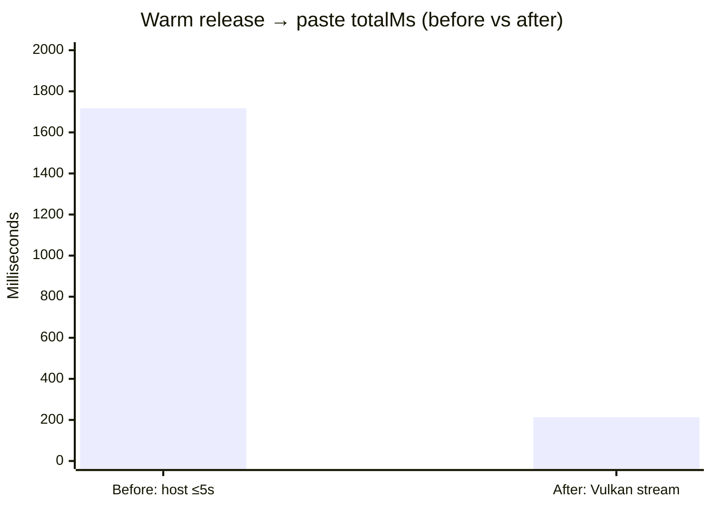

# Atmospeak Release Process

Atmospeak ships Windows-first release artifacts:

- NSIS installer: primary user download.
- MSI installer: enterprise-friendly fallback.
- Portable zip: unzip-and-run build containing `Atmospeak.exe`, sidecar runtime, and bundled resources.
- NSIS updater signature: signed Tauri v2 updater artifact used by `latest.json`.
- `latest.json`: Tauri updater metadata for GitHub Releases.
- `SHA256SUMS.txt`: checksum manifest for public verification.

## Local Release Build

```powershell
$env:ATMOSPEAK_RELEASE_REPO = "leviathofnoesia/atmospeak"
$env:TAURI_SIGNING_PRIVATE_KEY_PATH = "$env:USERPROFILE\.tauri\atmospeak\updater.key"
bun run release:build
```

The private updater key must stay outside the repository. The matching public
key is committed in `src-tauri/tauri.conf.json`.

The app uses Tauri's `createUpdaterArtifacts: true` mode so Windows builds emit
updater signatures for the NSIS and MSI installers. The public installer
download and the updater artifact both use the NSIS `.exe`.

## GitHub Release

Upload every file from `release/` to the `leviathofnoesia/atmospeak` release
tag matching the application version. The updater endpoint is:

```text
https://github.com/leviathofnoesia/atmospeak/releases/latest/download/latest.json
```

### Repository-rename updater bridge

Atmospeak builds released before the repository rename poll the legacy feed:

```text
https://github.com/leviathofnoesia/wind-speak/releases/latest/download/latest.json
```

Version 0.3.1 is the signed bridge release. Before publishing it:

1. Publish the signed installer, installer signature, checksums, and
   `latest.json` in the renamed `leviathofnoesia/atmospeak` repository.
2. Confirm both the legacy URL above and the new Atmospeak URL return the same
   `latest.json` through GitHub's repository-rename redirect.
3. Confirm both feeds resolve the installer named by `latest.json` and that its
   signature matches the embedded Tauri updater public key.
4. Install an older build that uses the legacy endpoint and verify it discovers
   and installs 0.3.1.

The 0.3.1 binary uses the new Atmospeak endpoint. Do not retire or break
GitHub's legacy repository redirect until all supported pre-0.3.1 installations
have been upgraded or otherwise sunset.

## Unsigned Windows Prototype

This milestone does not include Authenticode code signing. Windows SmartScreen
may warn until a trusted certificate or Azure Trusted Signing profile is wired
into Tauri's Windows signing config.

Tauri updater signatures are separate from Windows code signing. The updater
verifies that update artifacts match the public key embedded in the app. The
signature stored in `latest.json` is the content of
`atmospeak_<version>_x64-setup.exe.sig`.

## Install/Uninstall Smoke

```powershell
bun run release:test-install
```

The script installs the NSIS build into a temp directory, checks the executable
and bundled runtime/model resources, launches briefly, uninstalls silently, and
verifies the executable is removed.

## Native Latency Gates

Before packaging, run the isolated Windows/WebView2 harnesses:

```powershell
bun run validation:native-ptt
bun run validation:paste-latency
```



`validation:native-ptt` completes setup against a debug-only deterministic audio
fixture, saves a non-preset `Ctrl+Alt+F12` shortcut through Settings, sends the
native key-down/key-up sequence, and verifies that key release produces one
transcript, one injected database session, exactly one paste into a real Windows
text box, and that release→paste / inject stay within the warm budgets
(≤ 500 ms / ≤ 150 ms on the warm porcelain-moon fixture with Vulkan streaming).

| | Before | After |
| --- | ---: | ---: |
| Measured `totalMs` | ~1250–1840 | **190–244** |
| Budget | ≤ 2000 ms | ≤ **500** ms |

`validation:paste-latency` gates paste-only wall clock (≤ 300 ms) without
waiting on ASR.

The fixture seam is unavailable in release builds. This automation protects the
release-to-inject behavior, but it does not replace the human Elgato Wave:3
gates. Tests 001 and 005 must still pass with deliberate speech and be recorded
in `tests/manual/production-run-log.md` before publication.

## Docs checklist

For each public release, also update:

- `README.md` download links and “What ships in …” section
- `CHANGELOG.md` with measured before/after timings (charts when speed-focused)
- `docs/releases/vX.Y.Z.md` used as the GitHub release notes body
- `docs/streaming-asr.md` when session/commit behavior changes
