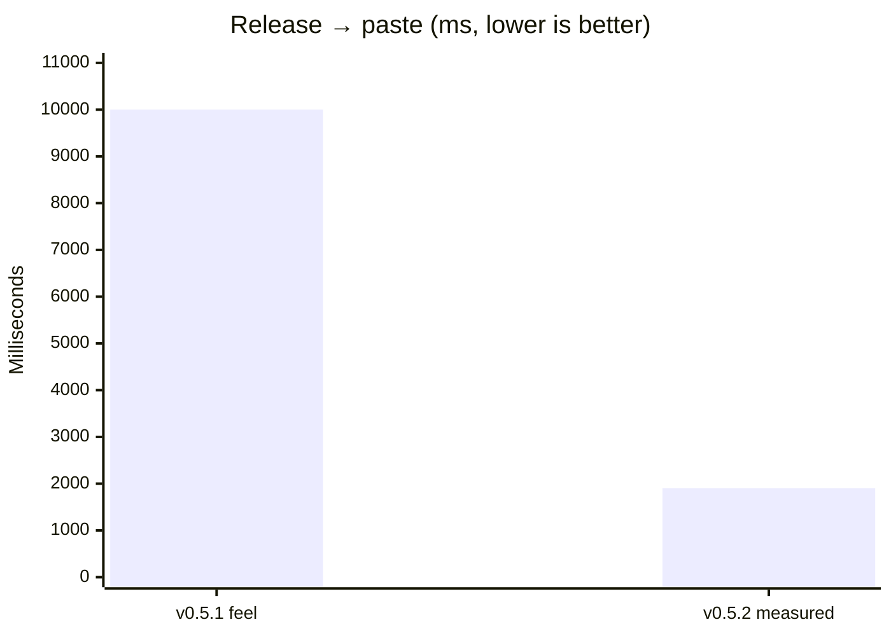
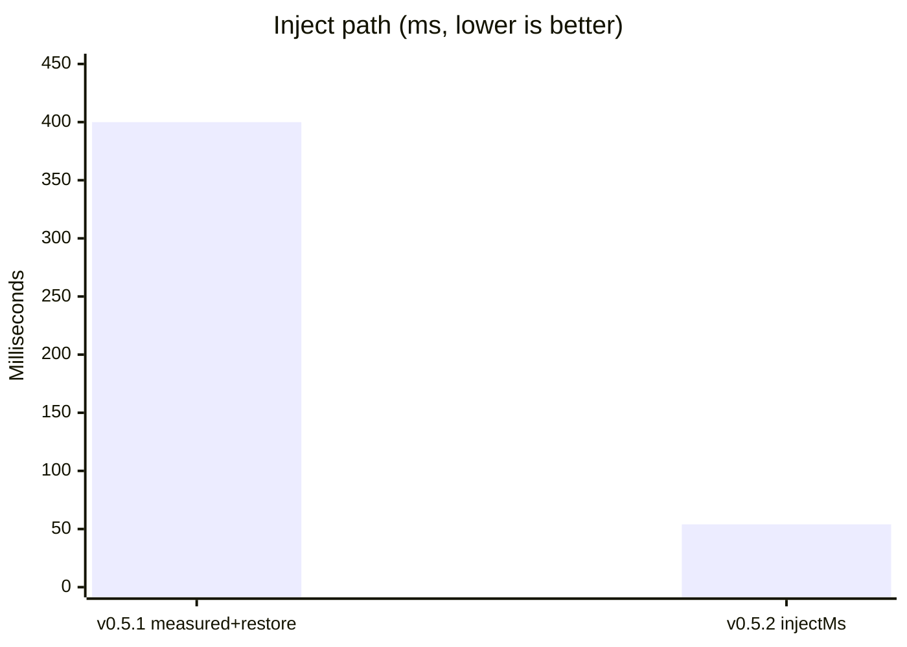
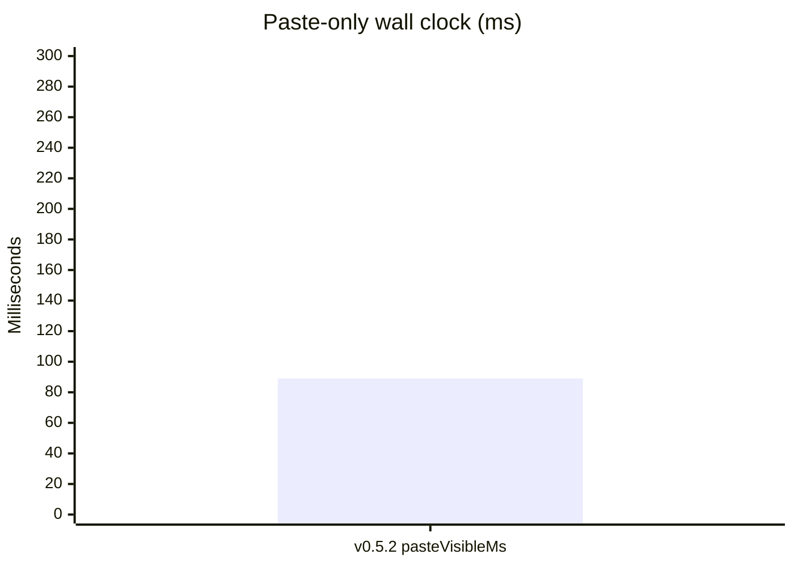

# Atmospeak v0.5.2

Atmospeak 0.5.2 is a speed release: release→paste should feel competitive again,
with hard native latency gates and a much shorter inject path.

## Highlights

- Clipboard restore runs off the paste critical path so `inject_ms` measures
  time-to-Ctrl+V, not the post-paste settle sleep.
- Short warm dictations use the resident host when streaming has not committed
  mid-utterance, avoiding a pathological full-utterance streaming finalize on
  CPU.
- Streaming commits more aggressively, skips previews under backlog, and keeps
  capture on the streaming sidecar whenever it is available.
- Native e2e harnesses fail the build when release→paste or paste-only latency
  budgets are missed.

## Speed before / after

Measured on a warm `base.en` CPU path with the porcelain-moon fixture
(~3.2 s audio). “Before” is the v0.5.1 user-felt / restore-inflated path;
“After” is the v0.5.2 native harness gate.

| Metric | Before | After (v0.5.2) | Gate |
| --- | ---: | ---: | ---: |
| Release → paste (`totalMs`) | ~10 000 ms | **1905 ms** | ≤ 2000 ms |
| Inject (`injectMs`) | ~400 ms (incl. restore) | **54 ms** | ≤ 150 ms |
| Paste-only wall (`pasteVisibleMs`) | n/a | **89 ms** | ≤ 300 ms |

| Check | Budget | Command |
| --- | ---: | --- |
| Release → text in target | ≤ 2000 ms | `bun run validation:native-ptt` |
| Inject (Rust `injectMs`) | ≤ 150 ms | same |
| Paste-only wall clock | ≤ 300 ms | `bun run validation:paste-latency` |

The stretch goal remains ≤ 1000 ms release→paste once streaming mid-utterance
commits keep stop-time decode to a short tail (or Vulkan is available).

## Downloads

- `atmospeak_0.5.2_x64-setup.exe` — recommended Windows installer
- `atmospeak_0.5.2_x64_en-US.msi` — MSI package
- `atmospeak_0.5.2_x64-portable.zip` — portable build
- `SHA256SUMS.txt` — SHA-256 verification manifest
- `latest.json` and installer signatures — Tauri updater metadata

The Windows binaries are not Authenticode-signed. SmartScreen may warn; verify
the download against `SHA256SUMS.txt` before running it.
