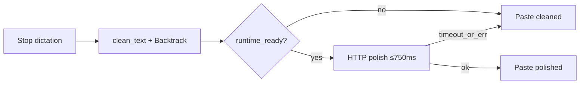

# Atmospeak v0.5.3

Atmospeak 0.5.3 adds deterministic Backtrack cleanup and an optional on-device AI
editor, without letting setup work block paste.

## Highlights

- **Backtrack in cleanup.** Stutter collapse, `actually` / `I mean` / `wait no`,
  `go back` / `forget that`, `as a X…as a Y`, and short restated phrases.
- **Bundled local AI editor.** Default provider is on-device `llama-server` +
  Qwen2.5 0.5B. Toggle AI auto-edit → download once from Settings → polish stays
  local. Advanced settings still allow Ollama / OpenAI-compatible endpoints.
- **Paste never waits on download.** If the bundled runtime is not ready,
  cleaned text pastes immediately. Timeouts log as `polish-timeout`; other
  failures as `polish-fallback`.
- **History undo/redo for AI edits.** Per-session polish preference without
  rewriting the cleaned transcript.
- **API keys in the OS keyring.** Never stored in SQLite; env fallbacks remain.

## Paste safety

## Operator acceptance

Still operator-run (not CI-greenwashed): production-100 cases **018–019**,
**049–058**, **064**.

## Artifacts

- `atmospeak_0.5.3_x64-setup.exe` — recommended Windows installer
- `atmospeak_0.5.3_x64_en-US.msi` — MSI package
- `atmospeak_0.5.3_x64-portable.zip` — portable build
- `SHA256SUMS.txt` — checksum manifest
- `latest.json` — Tauri updater metadata
