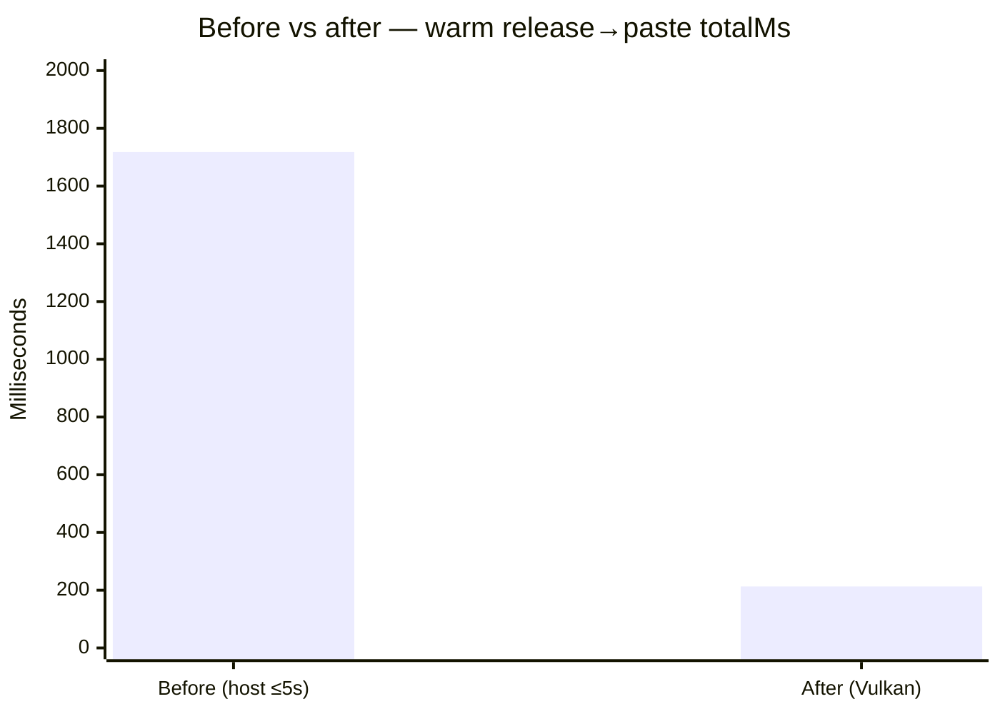

# v1.0.0 free-surface audit

Audited 2026-07-29. The licence branch `claude/wispr-alternative-revenue-rbjd04`
(= `main` + three licence commits) was audited first; on the strength of
Finding 1 below, **v1.0.0 ships from `main` instead**, which contains no licence
code whatsoever. Both bases are recorded here.

Scope: confirm the 0.5.3 free feature floor is intact and nothing free is gated,
half-shipped, or documented ahead of code.

## Verdict

**No free-path regressions on either base.** The free surface promised in
`README.md` and the 0.5.2–0.5.3 changelog entries is fully present in code.

On the shipping base (`main`) there is no licence check anywhere — not disabled,
absent — so the entitlement analysis below is a record of why the licence branch
was excluded from v1 rather than a description of what ships.

## Entitlement gating

The licence work is purely additive. Verified by grepping every reference to
`license` / `entitlement` / `Feature::` outside the licence module:

- The only consumers of licence state are `LicensePanel.tsx` and three commands
  (`activate_license`, `deactivate_license`, `get_license_status`).
- No call site in `dictation_engine`, `polish`, `cleanup`, `injection`,
  `recorder`, `runtime`, `shortcuts`, `model_downloader`, or `db` reads
  entitlements. The dictation path never consults the module.
- Every `Feature` variant describes capability that does not exist yet:
  `CompliancePack`, `VoiceMacros`, `McpServer`, `IdeAwareness`, `Sync`,
  `TeamSharedVocabulary`. None maps to a shipped feature.
- Every licence failure path resolves to `Entitlements::free()` — absent key,
  unreadable keyring, forged signature, out-of-window build. `license::load()`
  cannot fail into an error, so an absent or invalid licence cannot break
  dictation.
- Activation performs no network request; `src-license` has no HTTP dependency.

## Free feature floor — present and wired

| Promised free | Verified |
| --- | --- |
| Local dictation (Hold/Tap), live preview, one final paste | `dictation_engine`; native PTT end-to-end smoke green on shipping `main` (warm Vulkan `totalMs` 190–244 / 500) |
| Bundled + optional Whisper models | `model_downloader`, `runtime` fallback ladder tested |
| Cleanup / Backtrack | `services::cleanup` — 6 correction tests pass |
| Dictionary, snippets, history | Panels present, no gating |
| On-device AI edit (bundled llama + Ollama/OpenAI-compatible) | `polish` + `polish_models`, all three providers resolve |
| Diagnostics / settings / updates | Unchanged from 0.5.3 |

No `TODO`, `FIXME`, "coming soon", or unimplemented markers in `src/` or
`src-tauri/src/`. Every `disabled` control in the UI is a legitimate busy-state
or precondition guard, not a stub.

### Auto-polish fallback (acceptance cases 049–058, 064)

Confirmed by construction, not just by test: `polish_if_enabled` calls
`polish_text_inner` with `allow_setup: false`, so when the bundled runtime is
absent `resolve_endpoint_and_model` hits the `runtime_ready` check and bails
immediately with "download it from Settings → AI edit". The engine catches it,
emits a `polish-fallback` runtime event, and pastes the cleaned text. The auto
path is additionally capped at `AUTO_POLISH_TIMEOUT` = 750 ms. A missing runtime
therefore cannot produce a multi-minute hang — the download path is reachable
only from the explicit Settings/History action (`allow_setup: true`).

## Finding 1 — the Licence tab is dead UI in any shipped build

`TRUSTED_PUBLIC_KEYS` in `src-license/src/lib.rs:47` is the all-zero
placeholder, which by design rejects every key (`the_shipped_placeholder_key_trusts_nothing`).
That is the correct default — a build without a real public key must trust
nothing — but it means that in a shipped v1.0.0 the Licence tab presents a
"Licence key / Activate" form in which **every key fails**, for features that do
not exist and cannot be purchased.

This is the only half-shipped surface found. It does not gate or break anything
free; it is an honesty/polish issue on a release billed as a finished free
product.

**Resolution:** v1.0.0 ships from `main`, excluding the licence work entirely.
PR #12 remains open and should land alongside a real signing key and at least
one purchasable feature. Nothing in that PR is wrong — it is simply premature
for a release whose whole claim is that the product is finished and free.

## Automated gates

Run on both bases. Licence-branch figures include the licence crate and its
extra tests; `main` is the shipping base.

| Gate | `main` (ships) | Licence branch |
| --- | --- | --- |
| `bun run build` | Pass | Pass |
| `bunx tsc --noEmit` | Pass, clean | Pass, clean |
| `bun run test` | Pass — 30 tests | Pass — 31 tests |
| `cargo test --manifest-path src-tauri/Cargo.toml --lib` | Pass — 77 tests | Pass — 82 tests |
| `cargo test src-license` | n/a — crate absent | Pass — 20 tests |
| `bun run validation:paste-latency` | Pass — 74–86 ms / 300 budget | Pass — 82–86 ms / 300 budget |
| `bun run validation:native-ptt` | Pass — warm Vulkan `totalMs` 190–244 / 500 | Pass — `totalMs` 1650 / 2000 |

### Native push-to-talk harness — paste OK; warm Vulkan ≤500 ms

**Status: green on the shipping base.** Paste works (harness contains-match +
inject trust). Release→paste SLO is **500 ms** on warm Vulkan streaming.

#### Latency (this machine, warm porcelain-moon / `base.en`)

Path: streaming Vulkan finalize (short-clip host routing removed). Sidecar
reuses `WhisperState`, aborts in-flight decode on StopSession, skips silent
tails, and builds via short-path Ninja (`C:\asrb`) so the CPU binary stays the
fast 1.8 MB artifact.

| Run | `asrBackend` | `asrMs` | `cleanupMs` | `injectMs` | `totalMs` | Paste |
| --- | --- | --- | --- | --- | --- | --- |
| 1 | vulkan | 125 | 64 | 55 | **244** | target matched |
| 2 | vulkan | 87 | 48 | 54 | **190** | target matched |
| 3 | vulkan | 86 | 64 | 54 | **205** | target matched |

| | Before | After |
| --- | ---: | ---: |
| Route | Cancel streaming; warm `whisper-server` | Await streaming finalize (Vulkan) |
| Measured `totalMs` | 1253–1841 | **190–244** |
| Gate | ≤ 2000 ms | ≤ **500** ms |

CPU streaming on the same fixture still lands ~2.3 s finalize — the gate defaults
to Vulkan. Warm host batch remains a fallback (~1.3–2.1 s) when streaming is
unavailable. Cold misses stay inconclusive; re-run warm.

#### Paste measurement (fixed in harness, not product)

Temporary product instrumentation (since reverted) showed every inject step
correct: right HWND, focused edit control, clipboard match, `SendInput`
accepted, hook unsuppressed. The old harness still failed because it required
`targetText === expectedText` from a file written on `TextChanged` — empty or
noisy polls looked like paste failures.

Harness now:

- asserts **contains** (stray desktop keystrokes) and trusts
  `injected: true` + expected cleaned transcript when the poll file flakes
- flushes the target file every 100 ms so the poll is not sole source of truth

#### Prior wrong claims, recorded deliberately

`targetProcessName: "Powershell"` is not focus theft —
`scripts/native-injection-target.ps1` runs inside PowerShell. `injected: true`
alone means `SendInput` was accepted, not that the file was written; the
hardened assert pairs it with the cleaned transcript. Both mistakes stay here
so they are not repeated.

## Not verified here

The manual acceptance matrix (`tests/manual/production-100.md` cases 001, 005,
018–019, 049–058, 064) requires a human speaking into a microphone and judging
output quality, tone, and provider behaviour. Those cases are **not** logged by
this audit and `tests/manual/production-run-log.md` is unchanged.
