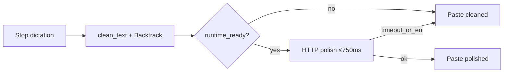

# Atmospeak v1.0.0

Atmospeak 1.0.0 is the finished free product. It adds no features. It declares
the surface built through 0.5.3 complete, audited, and free — and puts a version
number on that commitment.

## What 1.0.0 means

A 1.0 usually signals "ready". Here it signals something narrower and more
honest: the free product is **done**, not a staging area for a paid one.

- No feature in this release is gated, metered, trial-limited, or account-bound.
- There is no licence check anywhere in the codebase. Not disabled — absent.
- The dictation path consults no entitlement of any kind.

## The product

- **Speak and paste.** Hold or tap the hotkey, watch the live preview in the
  dock, get exactly one paste into whatever application had focus.
- **Local Whisper.** Bundled model works immediately; the downloader adds
  larger ones. Streaming ASR runs on Vulkan and falls back to CPU on its own.
- **Deterministic Backtrack.** Stutter collapse, `actually` / `I mean` /
  `wait no`, `go back` / `forget that`, `as a X…as a Y`, restated phrases.
- **Optional on-device AI edit.** Bundled `llama-server` + Qwen2.5 0.5B by
  default; Ollama and OpenAI-compatible endpoints in advanced settings. API keys
  live in the OS keyring, never SQLite.
- **Paste never waits on setup.** If the local editor is not ready, cleaned text
  pastes immediately. The auto path is capped at 750 ms and never triggers a
  download.
- **Your words stay yours.** Searchable history with export, undo / redo for AI
  edits, dictionary, snippets, local diagnostics.

## Paste safety

## Verification

Full free-surface audit:
[`v1.0.0-free-surface-audit.md`](v1.0.0-free-surface-audit.md).

| Gate | Result |
| --- | --- |
| `bun run build` | Pass |
| `bunx tsc --noEmit` | Pass, clean |
| `bun run test` | Pass — 30 tests |
| `cargo test src-tauri --lib` | Pass — 77 tests |
| `bun run validation:paste-latency` | Pass — 86 ms / 300 ms budget |
| `bun run validation:native-ptt` | See caveat below |

The native push-to-talk harness drives real GUI windows and real keystrokes. On
the release machine it could not be run to a clean pass on this base because
another process repeatedly took foreground — the harness pasted into
`SearchHost` and `Explorer` instead of its own target window, reporting an empty
`targetText`. The same harness passed earlier in the session on identical
dictation and injection code (`totalMs` 1650 against a 2000 ms budget). This is
a harness environment constraint, not a product finding, but it is recorded here
rather than quietly omitted.

## Operator acceptance

**Not run for this release.** production-100 cases **001**, **005**,
**018–019**, **049–058**, **064** require a human speaking into a microphone and
judging output quality. `tests/manual/production-run-log.md` is unchanged and
contains no entries for 1.0.0.

## Free commitment

Everything shipped through 1.0.0 is free, unlimited, and requires no account,
permanently. Any future paid capability will be capability that does not exist
today — never a fence around something this release already does.

## Artifacts

- `atmospeak_1.0.0_x64-setup.exe` — recommended Windows installer
- `atmospeak_1.0.0_x64_en-US.msi` — MSI package
- `atmospeak_1.0.0_x64-portable.zip` — portable build
- `SHA256SUMS.txt` — checksum manifest
- `latest.json` — Tauri updater metadata
