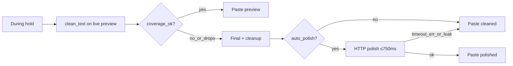

# Atmospeak v1.0.1

Patch release for paste latency and polish prompt leakage found after 1.0.0.

## Fixes

- **Preview paste with auto-polish on.** Release pastes the cleaned live
  hypothesis when coverage is good, without waiting on Final or the polish
  HTTP path. Users with polish enabled no longer hit multi-second
  finalize/fallback before paste.
- **Polish prompt leak.** The system prompt no longer includes
  `Provider mode: …`. Outputs that look like prompt echoes
  (e.g. `"Provider mode: Bundled."`) are rejected and cleaned text is used.

## Paste path

## Upgrade

Install over 1.0.0. No migration. Settings and history are unchanged.
